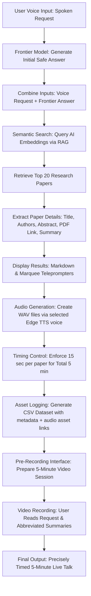

# FiveMinuteTalks
Auto Presentation Teleprompter AI For Teaching in Five Minutes

I am working on a ai app.py which I am using to create audio summaries of research papers and discuss what their impact on learning AI can be for training AI and people at once using audio, text, and speech modalities.  The workflow is voice in (spoken) to present a request, then a frontier model answers the question or request initially and inherits some degree of safety and training of the response from this initial request.  With it it then uses both inputs to search an AI embeddings using semantic search RAG ai which answers with selection of the top twenty research papers of the topic at hand.  This is shown in markdown and also marquee displays like singular teleprompters for each paper.  Then the paper link to abstract, the pdf, and the paper title and authors, and the paper summary are read aloud into wav files using a voice the user selected using the edge TTS voices (7).  Lets create a mermaid model for this.  My ideal would be how to create a live 5 minute talk which is perfectly timed as 15 seconds of read aloud per paper.  Help me with the graph as mermaid model first then I would like to share my code with you and you help me create a csv output for the dataset of assets, we save the assets and then on the interface we prepare the user for recording the five minute video where they read aloud request, each paper summary (abbreviated to match words per minute voice rate) and then crosses the timing finish line at exactly 5 minutes.    

Below is a sample of output for our first test together:   




```markdown
📄 How to Train Your Agent to Read and Write
### 04 Jan 2021 | How to Train Your Agent to Read and Write — Arxiv Link)

Authors: Li Liu, Mengge He, Guanghui Xu, Mingkui Tan, Qi Wu

Reading and writing research papers is one of the most privileged abilities that a qualified researcher should master. However, it is difficult for new researchers (\eg{students}) to fully {grasp} this ability. It would be fascinating if we could train an intelligent agent to help people read and summarize papers, and perhaps even discover and exploit the potential knowledge clues to write novel papers. Although there have been existing works focusing on summarizing (\emph{i.e.}, reading) the knowledge in a given text or generating (\emph{i.e.}, writing) a text based on the given knowledge, the ability of simultaneously reading and writing is still under development. Typically, this requires an agent to fully understand the knowledge from the given text materials and generate correct and fluent novel paragraphs, which is very challenging in practice. In this paper, we propose a Deep ReAder-Writer (DRAW) network, which consists of a \textit{Reader} that can extract knowledge graphs (KGs) from input paragraphs and discover potential knowledge, a graph-to-text \textit{Writer} that generates a novel paragraph, and a \textit{Reviewer} that reviews the generated paragraph from three different aspects. Extensive experiments show that our DRAW network outperforms considered baselines and several state-of-the-art methods on AGENDA and M-AGENDA datasets. Our code and supplementary are released at https://github.com/menggehe/DRAW. ---------------


📄 TSTR: Too Short to Represent, Summarize with Details! Intro-Guided Extended Summary Generation
### 02 Jun 2022 | TSTR: Too Short to Represent, Summarize with Details! Intro-Guided Extended Summary Generation — Arxiv Link)

Authors: Sajad Sotudeh, Nazli Goharian

Many scientific papers such as those in arXiv and PubMed data collections have abstracts with varying lengths of 50-1000 words and average length of approximately 200 words, where longer abstracts typically convey more information about the source paper. Up to recently, scientific summarization research has typically focused on generating short, abstract-like summaries following the existing datasets used for scientific summarization. In domains where the source text is relatively long-form, such as in scientific documents, such summary is not able to go beyond the general and coarse overview and provide salient information from the source document. The recent interest to tackle this problem motivated curation of scientific datasets, arXiv-Long and PubMed-Long, containing human-written summaries of 400-600 words, hence, providing a venue for research in generating long/extended summaries. Extended summaries facilitate a faster read while providing details beyond coarse information. In this paper, we propose TSTR, an extractive summarizer that utilizes the introductory information of documents as pointers to their salient information. The evaluations on two existing large-scale extended summarization datasets indicate statistically significant improvement in terms of Rouge and average Rouge (F1) scores (except in one case) as compared to strong baselines and state-of-the-art. Comprehensive human evaluations favor our generated extended summaries in terms of cohesion and completeness. ---------------


📄 NarrativeXL: A Large-scale Dataset For Long-Term Memory Models
### 08 Dec 2023 | NarrativeXL: A Large-scale Dataset For Long-Term Memory Models — Arxiv Link)

Authors: Arseny Moskvichev and Ky-Vinh Mai

We propose a new large-scale (nearly a million questions) ultra-long-context (more than 50,000 words average document length) reading comprehension dataset. Using GPT 3.5, we summarized each scene in 1,500 hand-curated fiction books from Project Gutenberg, which resulted in approximately 150 scene-level summaries per book. After that, we created a number of reading comprehension questions based on these summaries, including three types of multiple-choice scene recognition questions, as well as free-form narrative reconstruction questions. With 990,595 total questions, our dataset is an order of magnitude larger than the closest alternatives. Crucially, most questions have a known ``retention demand'', indicating how long-term of a memory is needed to answer them, which should aid long-term memory performance evaluation. We validate our data in four small-scale experiments: one with human labelers, and three with existing language models. We show that our questions 1) adequately represent the source material 2) can be used to diagnose a model's memory capacity 3) are not trivial for modern language models even when the memory demand does not exceed those models' context lengths. Lastly, we provide our code which can be used to further expand the dataset with minimal human labor. ---------------


📄 GigaSpeech: An Evolving, Multi-domain ASR Corpus with 10,000 Hours of Transcribed Audio
### 13 Jun 2021 | GigaSpeech: An Evolving, Multi-domain ASR Corpus with 10,000 Hours of Transcribed Audio — Arxiv Link)

Authors: Guoguo Chen, Shuzhou Chai, Guanbo Wang, Jiayu Du, Wei-Qiang Zhang, Chao Weng, Dan Su, Daniel Povey, Jan Trmal, Junbo Zhang, Mingjie Jin, Sanjeev Khudanpur, Shinji Watanabe, Shuaijiang Zhao, Wei Zou, Xiangang Li, Xuchen Yao, Yongqing Wang, Yujun Wang, Zhao You, Zhiyong Yan

This paper introduces GigaSpeech, an evolving, multi-domain English speech recognition corpus with 10,000 hours of high quality labeled audio suitable for supervised training, and 40,000 hours of total audio suitable for semi-supervised and unsupervised training. Around 40,000 hours of transcribed audio is first collected from audiobooks, podcasts and YouTube, covering both read and spontaneous speaking styles, and a variety of topics, such as arts, science, sports, etc. A new forced alignment and segmentation pipeline is proposed to create sentence segments suitable for speech recognition training, and to filter out segments with low-quality transcription. For system training, GigaSpeech provides five subsets of different sizes, 10h, 250h, 1000h, 2500h, and 10000h. For our 10,000-hour XL training subset, we cap the word error rate at 4% during the filtering/validation stage, and for all our other smaller training subsets, we cap it at 0%. The DEV and TEST evaluation sets, on the other hand, are re-processed by professional human transcribers to ensure high transcription quality. Baseline systems are provided for popular speech recognition toolkits, namely Athena, ESPnet, Kaldi and Pika. ---------------


📄 Leveraging supplementary text data to kick-start automatic speech recognition system development with limited transcriptions
### 09 Feb 2023 | Leveraging supplementary text data to kick-start automatic speech recognition system development with limited transcriptions — Arxiv Link)

Authors: Nay San, Martijn Bartelds, Blaine Billings, Ella de Falco, Hendi Feriza, Johan Safri, Wawan Sahrozi, Ben Foley, Bradley McDonnell, Dan Jurafsky

Recent research using pre-trained transformer models suggests that just 10 minutes of transcribed speech may be enough to fine-tune such a model for automatic speech recognition (ASR) — at least if we can also leverage vast amounts of text data (803 million tokens). But is that much text data necessary? We study the use of different amounts of text data, both for creating a lexicon that constrains ASR decoding to possible words (e.g. *dogz vs. dogs), and for training larger language models that bias the system toward probable word sequences (e.g. too dogs vs. two dogs). We perform experiments using 10 minutes of transcribed speech from English (for replicating prior work) and two additional pairs of languages differing in the availability of supplemental text data: Gronings and Frisian (~7.5M token corpora available), and Besemah and Nasal (only small lexica available). For all languages, we found that using only a lexicon did not appreciably improve ASR performance. For Gronings and Frisian, we found that lexica and language models derived from 'novel-length' 80k token subcorpora reduced the word error rate (WER) to 39% on average. Our findings suggest that where a text corpus in the upper tens of thousands of tokens or more is available, fine-tuning a transformer model with just tens of minutes of transcribed speech holds some promise towards obtaining human-correctable transcriptions near the 30% WER rule-of-thumb. ---------------


📄 QuALITY: Question Answering with Long Input Texts, Yes!
### 11 May 2022 | QuALITY: Question Answering with Long Input Texts, Yes! — Arxiv Link)

Authors: Richard Yuanzhe Pang, Alicia Parrish, Nitish Joshi, Nikita Nangia, Jason Phang, Angelica Chen, Vishakh Padmakumar, Johnny Ma, Jana Thompson, He He, Samuel R. Bowman

To enable building and testing models on long-document comprehension, we introduce QuALITY, a multiple-choice QA dataset with context passages in English that have an average length of about 5,000 tokens, much longer than typical current models can process. Unlike in prior work with passages, our questions are written and validated by contributors who have read the entire passage, rather than relying on summaries or excerpts. In addition, only half of the questions are answerable by annotators working under tight time constraints, indicating that skimming and simple search are not enough to consistently perform well. Our baseline models perform poorly on this task (55.4%) and significantly lag behind human performance (93.5%). ---------------


📄 Augmenting Scientific Papers with Just-in-Time, Position-Sensitive Definitions of Terms and Symbols
### 27 Apr 2021 | Augmenting Scientific Papers with Just-in-Time, Position-Sensitive Definitions of Terms and Symbols — Arxiv Link)

Authors: Andrew Head (UC Berkeley), Kyle Lo (Allen Institute for AI), Dongyeop Kang (UC Berkeley), Raymond Fok (University of Washington), Sam Skjonsberg (Allen Institute for AI), Daniel S. Weld (Allen Institute for AI, University of Washington), Marti A. Hearst (UC Berkeley)

Despite the central importance of research papers to scientific progress, they can be difficult to read. Comprehension is often stymied when the information needed to understand a passage resides somewhere else: in another section, or in another paper. In this work, we envision how interfaces can bring definitions of technical terms and symbols to readers when and where they need them most. We introduce ScholarPhi, an augmented reading interface with four novel features: (1) tooltips that surface position-sensitive definitions from elsewhere in a paper, (2) a filter over the paper that "declutters" it to reveal how the term or symbol is used across the paper, (3) automatic equation diagrams that expose multiple definitions in parallel, and (4) an automatically generated glossary of important terms and symbols. A usability study showed that the tool helps researchers of all experience levels read papers. Furthermore, researchers were eager to have ScholarPhi's definitions available to support their everyday reading. ---------------


📄 Community-Driven Comprehensive Scientific Paper Summarization: Insight from cvpaper.challenge
### 17 Mar 2022 | Community-Driven Comprehensive Scientific Paper Summarization: Insight from cvpaper.challenge — Arxiv Link)

Authors: Shintaro Yamamoto, Hirokatsu Kataoka, Ryota Suzuki, Seitaro Shinagawa, Shigeo Morishima

The present paper introduces a group activity involving writing summaries of conference proceedings by volunteer participants. The rapid increase in scientific papers is a heavy burden for researchers, especially non-native speakers, who need to survey scientific literature. To alleviate this problem, we organized a group of non-native English speakers to write summaries of papers presented at a computer vision conference to share the knowledge of the papers read by the group. We summarized a total of 2,000 papers presented at the Conference on Computer Vision and Pattern Recognition, a top-tier conference on computer vision, in 2019 and 2020. We quantitatively analyzed participants' selection regarding which papers they read among the many available papers. The experimental results suggest that we can summarize a wide range of papers without asking participants to read papers unrelated to their interests. ---------------


📄 A Multiple Choices Reading Comprehension Corpus for Vietnamese Language Education
### 31 Mar 2023 | A Multiple Choices Reading Comprehension Corpus for Vietnamese Language Education — Arxiv Link)

Authors: Son T. Luu, Khoi Trong Hoang, Tuong Quang Pham, Kiet Van Nguyen, Ngan Luu-Thuy Nguyen

Machine reading comprehension has been an interesting and challenging task in recent years, with the purpose of extracting useful information from texts. To attain the computer ability to understand the reading text and answer relevant information, we introduce ViMMRC 2.0 - an extension of the previous ViMMRC for the task of multiple-choice reading comprehension in Vietnamese Textbooks which contain the reading articles for students from Grade 1 to Grade 12. This dataset has 699 reading passages which are prose and poems, and 5,273 questions. The questions in the new dataset are not fixed with four options as in the previous version. Moreover, the difficulty of questions is increased, which challenges the models to find the correct choice. The computer must understand the whole context of the reading passage, the question, and the content of each choice to extract the right answers. Hence, we propose the multi-stage approach that combines the multi-step attention network (MAN) with the natural language inference (NLI) task to enhance the performance of the reading comprehension model. Then, we compare the proposed methodology with the baseline BERTology models on the new dataset and the ViMMRC 1.0. Our multi-stage models achieved 58.81% by Accuracy on the test set, which is 5.34% better than the highest BERTology models. From the results of the error analysis, we found the challenge of the reading comprehension models is understanding the implicit context in texts and linking them together in order to find the correct answers. Finally, we hope our new dataset will motivate further research in enhancing the language understanding ability of computers in the Vietnamese language. ---------------


📄 PubSqueezer: A Text-Mining Web Tool to Transform Unstructured Documents into Structured Data
### 09 Nov 2020 | PubSqueezer: A Text-Mining Web Tool to Transform Unstructured Documents into Structured Data — Arxiv Link)

Authors: Alberto Calderone

The amount of scientific papers published every day is daunting and constantly increasing. Keeping up with literature represents a challenge. If one wants to start exploring new topics it is hard to have a big picture without reading lots of articles. Furthermore, as one reads through literature, making mental connections is crucial to ask new questions which might lead to discoveries. In this work, I present a web tool which uses a Text Mining strategy to transform large collections of unstructured biomedical articles into structured data. Generated results give a quick overview on complex topics which can possibly suggest not explicitly reported information. In particular, I show two Data Science analyses. First, I present a literature based rare diseases network build using this tool in the hope that it will help clarify some aspects of these less popular pathologies. Secondly, I show how a literature based analysis conducted with PubSqueezer results allows to describe known facts about SARS-CoV-2. In one sentence, data generated with PubSqueezer make it easy to use scientific literate in any computational analysis such as machine learning, natural language processing etc. Availability: http://www.pubsqueezer.com ---------------


📄 True Detective: A Deep Abductive Reasoning Benchmark Undoable for GPT-3 and Challenging for GPT-4
### 01 Jun 2023 | True Detective: A Deep Abductive Reasoning Benchmark Undoable for GPT-3 and Challenging for GPT-4 — Arxiv Link)

Authors: Maksym Del and Mark Fishel

Large language models (LLMs) have demonstrated solid zero-shot reasoning capabilities, which is reflected in their performance on the current test tasks. This calls for a more challenging benchmark requiring highly advanced reasoning ability to be solved. In this paper, we introduce such a benchmark, consisting of 191 long-form (1200 words on average) mystery narratives constructed as detective puzzles. Puzzles are sourced from the "5 Minute Mystery" platform and include a multiple-choice question for evaluation. Only 47% of humans solve a puzzle successfully on average, while the best human solvers achieve over 80% success rate. We show that GPT-3 models barely outperform random on this benchmark (with 28% accuracy) while state-of-the-art GPT-4 solves only 38% of puzzles. This indicates that there is still a significant gap in the deep reasoning abilities of LLMs and humans and highlights the need for further research in this area. Our work introduces a challenging benchmark for future studies on reasoning in language models and contributes to a better understanding of the limits of LLMs' abilities. ---------------


📄 A Dataset of Information-Seeking Questions and Answers Anchored in Research Papers
### 07 May 2021 | A Dataset of Information-Seeking Questions and Answers Anchored in Research Papers — Arxiv Link)

Authors: Pradeep Dasigi, Kyle Lo, Iz Beltagy, Arman Cohan, Noah A. Smith, Matt Gardner

Readers of academic research papers often read with the goal of answering specific questions. Question Answering systems that can answer those questions can make consumption of the content much more efficient. However, building such tools requires data that reflect the difficulty of the task arising from complex reasoning about claims made in multiple parts of a paper. In contrast, existing information-seeking question answering datasets usually contain questions about generic factoid-type information. We therefore present QASPER, a dataset of 5,049 questions over 1,585 Natural Language Processing papers. Each question is written by an NLP practitioner who read only the title and abstract of the corresponding paper, and the question seeks information present in the full text. The questions are then answered by a separate set of NLP practitioners who also provide supporting evidence to answers. We find that existing models that do well on other QA tasks do not perform well on answering these questions, underperforming humans by at least 27 F1 points when answering them from entire papers, motivating further research in document-grounded, information-seeking QA, which our dataset is designed to facilitate. ---------------


📄 GPT Takes the Bar Exam
### 29 Dec 2022 | GPT Takes the Bar Exam — Arxiv Link)

Authors: Michael Bommarito II, Daniel Martin Katz

Nearly all jurisdictions in the United States require a professional license exam, commonly referred to as "the Bar Exam," as a precondition for law practice. To even sit for the exam, most jurisdictions require that an applicant completes at least seven years of post-secondary education, including three years at an accredited law school. In addition, most test-takers also undergo weeks to months of further, exam-specific preparation. Despite this significant investment of time and capital, approximately one in five test-takers still score under the rate required to pass the exam on their first try. In the face of a complex task that requires such depth of knowledge, what, then, should we expect of the state of the art in "AI?" In this research, we document our experimental evaluation of the performance of OpenAI's text-davinci-003 model, often-referred to as GPT-3.5, on the multistate multiple choice (MBE) section of the exam. While we find no benefit in fine-tuning over GPT-3.5's zero-shot performance at the scale of our training data, we do find that hyperparameter optimization and prompt engineering positively impacted GPT-3.5's zero-shot performance. For best prompt and parameters, GPT-3.5 achieves a headline correct rate of 50.3% on a complete NCBE MBE practice exam, significantly in excess of the 25% baseline guessing rate, and performs at a passing rate for both Evidence and Torts. GPT-3.5's ranking of responses is also highly-correlated with correctness; its top two and top three choices are correct 71% and 88% of the time, respectively, indicating very strong non-entailment performance. While our ability to interpret these results is limited by nascent scientific understanding of LLMs and the proprietary nature of GPT, we believe that these results strongly suggest that an LLM will pass the MBE component of the Bar Exam in the near future. ---------------


📄 Explaining Relationships Among Research Papers
### 20 Feb 2024 | Explaining Relationships Among Research Papers — Arxiv Link)

Authors: Xiangci Li and Jessica Ouyang

Due to the rapid pace of research publications, keeping up to date with all the latest related papers is very time-consuming, even with daily feed tools. There is a need for automatically generated, short, customized literature reviews of sets of papers to help researchers decide what to read. While several works in the last decade have addressed the task of explaining a single research paper, usually in the context of another paper citing it, the relationship among multiple papers has been ignored; prior works have focused on generating a single citation sentence in isolation, without addressing the expository and transition sentences needed to connect multiple papers in a coherent story. In this work, we explore a feature-based, LLM-prompting approach to generate richer citation texts, as well as generating multiple citations at once to capture the complex relationships among research papers. We perform an expert evaluation to investigate the impact of our proposed features on the quality of the generated paragraphs and find a strong correlation between human preference and integrative writing style, suggesting that humans prefer high-level, abstract citations, with transition sentences between them to provide an overall story. ---------------


📄 Who Said What? An Automated Approach to Analyzing Speech in Preschool Classrooms
### 05 Mar 2024 | Who Said What? An Automated Approach to Analyzing Speech in Preschool Classrooms — Arxiv Link)

Authors: Anchen Sun, Juan J Londono, Batya Elbaum, Luis Estrada, Roberto Jose Lazo, Laura Vitale, Hugo Gonzalez Villasanti, Riccardo Fusaroli, Lynn K Perry, Daniel S Messinger

Young children spend substantial portions of their waking hours in noisy preschool classrooms. In these environments, children's vocal interactions with teachers are critical contributors to their language outcomes, but manually transcribing these interactions is prohibitive. Using audio from child- and teacher-worn recorders, we propose an automated framework that uses open source software both to classify speakers (ALICE) and to transcribe their utterances (Whisper). We compare results from our framework to those from a human expert for 110 minutes of classroom recordings, including 85 minutes from child-word microphones (n=4 children) and 25 minutes from teacher-worn microphones (n=2 teachers). The overall proportion of agreement, that is, the proportion of correctly classified teacher and child utterances, was .76, with an error-corrected kappa of .50 and a weighted F1 of .76. The word error rate for both teacher and child transcriptions was .15, meaning that 15% of words would need to be deleted, added, or changed to equate the Whisper and expert transcriptions. Moreover, speech features such as the mean length of utterances in words, the proportion of teacher and child utterances that were questions, and the proportion of utterances that were responded to within 2.5 seconds were similar when calculated separately from expert and automated transcriptions. The results suggest substantial progress in analyzing classroom speech that may support children's language development. Future research using natural language processing is underway to improve speaker classification and to analyze results from the application of the automated it framework to a larger dataset containing classroom recordings from 13 children and 4 teachers observed on 17 occasions over one year. ---------------


📄 Modeling Task Effects on Meaning Representation in the Brain via Zero-Shot MEG Prediction
### 15 Nov 2020 | Modeling Task Effects on Meaning Representation in the Brain via Zero-Shot MEG Prediction — Arxiv Link)

Authors: Mariya Toneva, Otilia Stretcu, Barnabas Poczos, Leila Wehbe, Tom M. Mitchell

How meaning is represented in the brain is still one of the big open questions in neuroscience. Does a word (e.g., bird) always have the same representation, or does the task under which the word is processed alter its representation (answering "can you eat it?" versus "can it fly?")? The brain activity of subjects who read the same word while performing different semantic tasks has been shown to differ across tasks. However, it is still not understood how the task itself contributes to this difference. In the current work, we study Magnetoencephalography (MEG) brain recordings of participants tasked with answering questions about concrete nouns. We investigate the effect of the task (i.e. the question being asked) on the processing of the concrete noun by predicting the millisecond-resolution MEG recordings as a function of both the semantics of the noun and the task. Using this approach, we test several hypotheses about the task-stimulus interactions by comparing the zero-shot predictions made by these hypotheses for novel tasks and nouns not seen during training. We find that incorporating the task semantics significantly improves the prediction of MEG recordings, across participants. The improvement occurs 475-550ms after the participants first see the word, which corresponds to what is considered to be the ending time of semantic processing for a word. These results suggest that only the end of semantic processing of a word is task-dependent, and pose a challenge for future research to formulate new hypotheses for earlier task effects as a function of the task and stimuli. ---------------


📄 Quiz-Style Question Generation for News Stories
### 18 Feb 2021 | Quiz-Style Question Generation for News Stories — Arxiv Link)

Authors: Adam D. Lelkes, Vinh Q. Tran, Cong Yu

A large majority of American adults get at least some of their news from the Internet. Even though many online news products have the goal of informing their users about the news, they lack scalable and reliable tools for measuring how well they are achieving this goal, and therefore have to resort to noisy proxy metrics (e.g., click-through rates or reading time) to track their performance. As a first step towards measuring news informedness at a scale, we study the problem of quiz-style multiple-choice question generation, which may be used to survey users about their knowledge of recent news. In particular, we formulate the problem as two sequence-to-sequence tasks: question-answer generation (QAG) and distractor, or incorrect answer, generation (DG). We introduce NewsQuizQA, the first dataset intended for quiz-style question-answer generation, containing 20K human written question-answer pairs from 5K news article summaries. Using this dataset, we propose a series of novel techniques for applying large pre-trained Transformer encoder-decoder models, namely PEGASUS and T5, to the tasks of question-answer generation and distractor generation. We show that our models outperform strong baselines using both automated metrics and human raters. We provide a case study of running weekly quizzes on real-world users via the Google Surveys platform over the course of two months. We found that users generally found the automatically generated questions to be educational and enjoyable. Finally, to serve the research community, we are releasing the NewsQuizQA dataset. ---------------


📄 Interpretation of Natural Language Rules in Conversational Machine Reading
### 28 Aug 2018 | Interpretation of Natural Language Rules in Conversational Machine Reading — Arxiv Link)

Authors: Marzieh Saeidi, Max Bartolo, Patrick Lewis, Sameer Singh, Tim Rockt"aschel, Mike Sheldon, Guillaume Bouchard, Sebastian Riedel

Most work in machine reading focuses on question answering problems where the answer is directly expressed in the text to read. However, many real-world question answering problems require the reading of text not because it contains the literal answer, but because it contains a recipe to derive an answer together with the reader's background knowledge. One example is the task of interpreting regulations to answer "Can I...?" or "Do I have to...?" questions such as "I am working in Canada. Do I have to carry on paying UK National Insurance?" after reading a UK government website about this topic. This task requires both the interpretation of rules and the application of background knowledge. It is further complicated due to the fact that, in practice, most questions are underspecified, and a human assistant will regularly have to ask clarification questions such as "How long have you been working abroad?" when the answer cannot be directly derived from the question and text. In this paper, we formalise this task and develop a crowd-sourcing strategy to collect 32k task instances based on real-world rules and crowd-generated questions and scenarios. We analyse the challenges of this task and assess its difficulty by evaluating the performance of rule-based and machine-learning baselines. We observe promising results when no background knowledge is necessary, and substantial room for improvement whenever background knowledge is needed. ---------------


📄 The Semantic Reader Project: Augmenting Scholarly Documents through AI-Powered Interactive Reading Interfaces
### 23 Apr 2023 | The Semantic Reader Project: Augmenting Scholarly Documents through AI-Powered Interactive Reading Interfaces — Arxiv Link)

Authors: Kyle Lo, Joseph Chee Chang, Andrew Head, Jonathan Bragg, Amy X. Zhang, Cassidy Trier, Chloe Anastasiades, Tal August, Russell Authur, Danielle Bragg, Erin Bransom, Isabel Cachola, Stefan Candra, Yoganand Chandrasekhar, Yen-Sung Chen, Evie Yu-Yen Cheng, Yvonne Chou, Doug Downey, Rob Evans, Raymond Fok, Fangzhou Hu, Regan Huff, Dongyeop Kang, Tae Soo Kim, Rodney Kinney, Aniket Kittur, Hyeonsu Kang, Egor Klevak, Bailey Kuehl, Michael Langan, Matt Latzke, Jaron Lochner, Kelsey MacMillan, Eric Marsh, Tyler Murray, Aakanksha Naik, Ngoc-Uyen Nguyen, Srishti Palani, Soya Park, Caroline Paulic, Napol Rachatasumrit, Smita Rao, Paul Sayre, Zejiang Shen, Pao Siangliulue, Luca Soldaini, Huy Tran, Madeleine van Zuylen, Lucy Lu Wang, Christopher Wilhelm, Caroline Wu, Jiangjiang Yang, Angele Zamarron, Marti A. Hearst, Daniel S. Weld

Scholarly publications are key to the transfer of knowledge from scholars to others. However, research papers are information-dense, and as the volume of the scientific literature grows, the need for new technology to support the reading process grows. In contrast to the process of finding papers, which has been transformed by Internet technology, the experience of reading research papers has changed little in decades. The PDF format for sharing research papers is widely used due to its portability, but it has significant downsides including: static content, poor accessibility for low-vision readers, and difficulty reading on mobile devices. This paper explores the question "Can recent advances in AI and HCI power intelligent, interactive, and accessible reading interfaces — even for legacy PDFs?" We describe the Semantic Reader Project, a collaborative effort across multiple institutions to explore automatic creation of dynamic reading interfaces for research papers. Through this project, we've developed ten research prototype interfaces and conducted usability studies with more than 300 participants and real-world users showing improved reading experiences for scholars. We've also released a production reading interface for research papers that will incorporate the best features as they mature. We structure this paper around challenges scholars and the public face when reading research papers — Discovery, Efficiency, Comprehension, Synthesis, and Accessibility — and present an overview of our progress and remaining open challenges. ---------------


📄 Continuous Examination by Automatic Quiz Assessment Using Spiral Codes and Image Processing
### 26 Jan 2022 | Continuous Examination by Automatic Quiz Assessment Using Spiral Codes and Image Processing — Arxiv Link)

Authors: Fernando Alonso-Fernandez, Josef Bigun

We describe a technical solution implemented at Halmstad University to automatise assessment and reporting of results of paper-based quiz exams. Paper quizzes are affordable and within reach of campus education in classrooms. Offering and taking them is accepted as they cause fewer issues with reliability and democratic access, e.g. a large number of students can take them without a trusted mobile device, internet, or battery. By contrast, correction of the quiz is a considerable obstacle. We suggest mitigating the issue by a novel image processing technique using harmonic spirals that aligns answer sheets in sub-pixel accuracy to read student identity and answers and to email results within minutes, all fully automatically. Using the described method, we carry out regular weekly examinations in two master courses at the mentioned centre without a significant workload increase. The employed solution also enables us to assign a unique identifier to each quiz (e.g. week 1, week 2. . . ) while allowing us to have an individualised quiz for each student. ---------------
```

Claude's reply 🧠:

```python
To create a Streamlit app that addresses your request for a 5-minute high-resolution read-aloud and summarizing 20 research papers on assistive devices for speaking, reading, vocalization, and research, I would need access to those 20 research papers. However, since you did not provide the actual papers, I'll create a sample Streamlit app that demonstrates how it could be done.

Here's the app.py file:

import streamlit as st
import pyttsx3

# Initialize the text-to-speech engine
engine = pyttsx3.init()

# Set the voice rate and volume
engine.setProperty('rate', 150)  # Adjust the rate as per your preference
engine.setProperty('volume', 1.0)  # Adjust the volume as per your preference

# Function to read text aloud
def read_aloud(text):
    engine.say(text)
    engine.runAndWait()

# Function to summarize research papers
def summarize_papers(papers):
    summaries = []
    for paper in papers:
        # Placeholder for actual summarization logic
        summary = f"Summary of {paper}: ..."
        summaries.append(summary)
    return summaries

# Sample research papers (replace with actual papers)
research_papers = [
    "Paper 1: Assistive Technology for Speech Impairments",
    "Paper 2: Reading Aids for Visually Impaired Individuals",
    "Paper 3: Voice Recognition in Research and Education",
    # Add more papers here
]

# Streamlit app
def main():
    st.title("Assistive Devices for Speaking, Reading, and Research")

    # Read-aloud section
    st.header("Read Aloud")
    text_to_read = st.text_area("Enter text to be read aloud:")
    if st.button("Read Aloud"):
        read_aloud(text_to_read)

    # Research paper summaries section
    st.header("Research Paper Summaries")
    summaries = summarize_papers(research_papers)
    for summary in summaries:
        st.write(summary)

if __name__ == "__main__":
    main()

And the requirements.txt file:

streamlit
pyttsx3

This Streamlit app has two main sections:

Read Aloud: Users can enter text in a text area, and upon clicking the "Read Aloud" button, the text will be read aloud using the pyttsx3 library for text-to-speech.

Research Paper Summaries: This section assumes that you have a list of research papers. The summarize_papers function is a placeholder for the actual summarization logic, which you would need to implement based on the specific techniques or algorithms you want to use for summarizing the papers. The summaries are then displayed in the app.

To run the app, follow these steps:

Install the required libraries by running pip install -r requirements.txt in your terminal or command prompt.
Save the app.py file in your working directory.
Run the app with streamlit run app.py.
Please note that this is a basic example, and you may need to modify the code to fit your specific requirements, such as incorporating actual research papers and implementing the summarization logic.

Total Elapsed: 26.76 s
```


# Next we share our code with instructions to build on the context we have - shot 2

Here is my code.  The output creates a filename and each part of the research papers has an opportunity  to show a word count of the response with title, authors and summary.  If we just read aloud at normal human speed the paper title and a summary of the summry, say just the right number of words so we can estimate the duration of read aloud for the title and summary together that might work really great.  Then at end of the titles plus summary give a total length estimation.  It actually will be physically possible to save the duration.  Lets modify the file naming outputs to contain something like a small sequence that indicates word count for that paper summary and title (wct200) for word count 200, summary (sw500) is summary had 500 words, (dur15) for duration of words spoken if you read aloud title and high info keyword list (compose new 15 word summary of high info words) from text which best satisfies high rouge score to a summary on the summary which we will use to optimize the read aloud duration.    Here is the app.py.  Good lucck and make me proud.  Score yourself at the end.  Ideally I want just the full code listing back with no explanation.  Also for any comments you would have had, inject those as comments around the new code and ffunctions you create and modify allowing me to easily see what you added.  Thanks and be careful to not break my code and also to show full code listing so I don't have to patch your code in myself.     

```python
import streamlit as st
import anthropic
import openai
import base64
import cv2
import glob
import json
import math
import os
import pytz
import random
import re
import requests
#import textract
import time
import zipfile
import plotly.graph_objects as go
import streamlit.components.v1 as components
from datetime import datetime
from audio_recorder_streamlit import audio_recorder
from bs4 import BeautifulSoup
from collections import defaultdict, deque, Counter
from dotenv import load_dotenv
from gradio_client import Client
from huggingface_hub import InferenceClient
from io import BytesIO
from PIL import Image
from PyPDF2 import PdfReader
from urllib.parse import quote
from xml.etree import ElementTree as ET
from openai import OpenAI
import extra_streamlit_components as stx
from streamlit.runtime.scriptrunner import get_script_run_ctx
import asyncio
import edge_tts
from streamlit_marquee import streamlit_marquee
from typing import Tuple, Optional
import pandas as pd

# ─────────────────────────────────────────────────────────
# 1. CORE CONFIGURATION & SETUP
# ─────────────────────────────────────────────────────────

st.set_page_config(
    page_title="🚲TalkingAIResearcher🏆",
    page_icon="🚲🏆",
    layout="wide",
    initial_sidebar_state="auto",
    menu_items={
        'Get Help': 'https://huggingface.co/awacke1',
        'Report a bug': 'https://huggingface.co/spaces/awacke1',
        'About': "🚲TalkingAIResearcher🏆"
    }
)
load_dotenv()

# ▶ Available English voices for Edge TTS
EDGE_TTS_VOICES = [
    "en-US-AriaNeural",
    "en-US-GuyNeural",
    "en-US-JennyNeural",
    "en-GB-SoniaNeural",
    "en-GB-RyanNeural",
    "en-AU-NatashaNeural",
    "en-AU-WilliamNeural",
    "en-CA-ClaraNeural",
    "en-CA-LiamNeural"
]

# ▶ Initialize Session State
if 'marquee_settings' not in st.session_state:
    st.session_state['marquee_settings'] = {
        "background": "#1E1E1E",
        "color": "#FFFFFF",
        "font-size": "14px",
        "animationDuration": "20s",
        "width": "100%",
        "lineHeight": "35px"
    }
if 'tts_voice' not in st.session_state:
    st.session_state['tts_voice'] = EDGE_TTS_VOICES[0]
if 'audio_format' not in st.session_state:
    st.session_state['audio_format'] = 'mp3'
if 'transcript_history' not in st.session_state:
    st.session_state['transcript_history'] = []
if 'chat_history' not in st.session_state:
    st.session_state['chat_history'] = []
if 'openai_model' not in st.session_state:
    st.session_state['openai_model'] = "gpt-4o-2024-05-13"
if 'messages' not in st.session_state:
    st.session_state['messages'] = []
if 'last_voice_input' not in st.session_state:
    st.session_state['last_voice_input'] = ""
if 'editing_file' not in st.session_state:
    st.session_state['editing_file'] = None
if 'edit_new_name' not in st.session_state:
    st.session_state['edit_new_name'] = ""
if 'edit_new_content' not in st.session_state:
    st.session_state['edit_new_content'] = ""
if 'viewing_prefix' not in st.session_state:
    st.session_state['viewing_prefix'] = None
if 'should_rerun' not in st.session_state:
    st.session_state['should_rerun'] = False
if 'old_val' not in st.session_state:
    st.session_state['old_val'] = None
if 'last_query' not in st.session_state:
    st.session_state['last_query'] = ""
if 'marquee_content' not in st.session_state:
    st.session_state['marquee_content'] = "🚀 Welcome to TalkingAIResearcher | 🤖 Your Research Assistant"

# ▶ Additional keys for performance, caching, etc.
if 'audio_cache' not in st.session_state:
    st.session_state['audio_cache'] = {}
if 'download_link_cache' not in st.session_state:
    st.session_state['download_link_cache'] = {}
if 'operation_timings' not in st.session_state:
    st.session_state['operation_timings'] = {}
if 'performance_metrics' not in st.session_state:
    st.session_state['performance_metrics'] = defaultdict(list)
if 'enable_audio' not in st.session_state:
    st.session_state['enable_audio'] = True  # Turn TTS on/off

# ▶ API Keys
openai_api_key = os.getenv('OPENAI_API_KEY', "")
anthropic_key = os.getenv('ANTHROPIC_API_KEY_3', "")
xai_key = os.getenv('xai',"")
if 'OPENAI_API_KEY' in st.secrets:
    openai_api_key = st.secrets['OPENAI_API_KEY']
if 'ANTHROPIC_API_KEY' in st.secrets:
    anthropic_key = st.secrets["ANTHROPIC_API_KEY"]

openai.api_key = openai_api_key
openai_client = OpenAI(api_key=openai.api_key, organization=os.getenv('OPENAI_ORG_ID'))
HF_KEY = os.getenv('HF_KEY')
API_URL = os.getenv('API_URL')

# ▶ Helper constants
FILE_EMOJIS = {
    "md": "📝",
    "mp3": "🎵",
    "wav": "🔊"
}

# ─────────────────────────────────────────────────────────
# 2. PERFORMANCE MONITORING & TIMING
# ─────────────────────────────────────────────────────────

class PerformanceTimer:
    """
    ⏱️ A context manager for timing operations with automatic logging.
    Usage:
        with PerformanceTimer("my_operation"):
            # do something
    The duration is stored into `st.session_state['operation_timings']`
    and appended to the `performance_metrics` list.
    """
    def __init__(self, operation_name: str):
        self.operation_name = operation_name
        self.start_time = None
        
    def __enter__(self):
        self.start_time = time.time()
        return self
        
    def __exit__(self, exc_type, exc_val, exc_tb):
        if not exc_type:  # Only log if no exception occurred
            duration = time.time() - self.start_time
            st.session_state['operation_timings'][self.operation_name] = duration
            st.session_state['performance_metrics'][self.operation_name].append(duration)

def log_performance_metrics():
    """
    📈 Display performance metrics in the sidebar, including a timing breakdown
    and a small bar chart of average times.
    """
    st.sidebar.markdown("### ⏱️ Performance Metrics")
    
    metrics = st.session_state['operation_timings']
    if metrics:
        total_time = sum(metrics.values())
        st.sidebar.write(f"**Total Processing Time:** {total_time:.2f}s")
        
        # Break down each operation time
        for operation, duration in metrics.items():
            percentage = (duration / total_time) * 100
            st.sidebar.write(f"**{operation}:** {duration:.2f}s ({percentage:.1f}%)")
            
        # Show timing history chart
        history_data = []
        for op, times in st.session_state['performance_metrics'].items():
            if times:  # Only if we have data
                avg_time = sum(times) / len(times)
                history_data.append({"Operation": op, "Avg Time (s)": avg_time})
        
        if history_data:
            st.sidebar.markdown("### 📊 Timing History (Avg)")
            chart_data = pd.DataFrame(history_data)
            st.sidebar.bar_chart(chart_data.set_index("Operation"))

# ─────────────────────────────────────────────────────────
# 3. HELPER FUNCTIONS (FILENAMES, LINKS, MARQUEE, ETC.)
# ─────────────────────────────────────────────────────────

def get_central_time():
    """🌎 Get current time in US Central timezone."""
    central = pytz.timezone('US/Central')
    return datetime.now(central)

def format_timestamp_prefix():
    """📅 Generate a timestamp prefix"""
    ct = get_central_time()
    #return ct.strftime("%m_%d_%y_%I_%M_%p")
    return ct.strftime("%Y%m%d_%H%M%S")

def initialize_marquee_settings():
    """🌈 Initialize marquee defaults if needed."""
    if 'marquee_settings' not in st.session_state:
        st.session_state['marquee_settings'] = {
            "background": "#1E1E1E",
            "color": "#FFFFFF",
            "font-size": "14px",
            "animationDuration": "20s",
            "width": "100%",
            "lineHeight": "35px"
        }

def get_marquee_settings():
    """🔧 Retrieve marquee settings from session."""
    initialize_marquee_settings()
    return st.session_state['marquee_settings']

def update_marquee_settings_ui():
    """🖌 Add color pickers & sliders for marquee config in the sidebar."""
    st.sidebar.markdown("### 🎯 Marquee Settings")
    cols = st.sidebar.columns(2)
    with cols[0]:
        bg_color = st.color_picker("🎨 Background", 
                                  st.session_state['marquee_settings']["background"], 
                                  key="bg_color_picker")
        text_color = st.color_picker("✍️ Text", 
                                    st.session_state['marquee_settings']["color"], 
                                    key="text_color_picker")
    with cols[1]:
        font_size = st.slider("📏 Size", 10, 24, 14, key="font_size_slider")
        duration = st.slider("⏱️ Speed (secs)", 1, 20, 20, key="duration_slider")

    st.session_state['marquee_settings'].update({
        "background": bg_color,
        "color": text_color,
        "font-size": f"{font_size}px",
        "animationDuration": f"{duration}s"
    })

def display_marquee(text, settings, key_suffix=""):
    """
    🎉 Show a marquee text with style from the marquee settings.
    Automatically truncates text to ~280 chars to avoid overflow.
    """
    truncated_text = text[:280] + "..." if len(text) > 280 else text
    streamlit_marquee(
        content=truncated_text,
        **settings,
        key=f"marquee_{key_suffix}"
    )
    st.write("")

def get_high_info_terms(text: str, top_n=10) -> list:
    """
    📌 Extract top_n frequent words & bigrams (excluding common stopwords).
    Useful for generating short descriptive keywords from Q/A content.
    """
    stop_words = set(['the', 'a', 'an', 'and', 'or', 'but', 'in', 'on', 'at', 'to', 'for', 'of', 'with'])
    words = re.findall(r'\b\w+(?:-\w+)*\b', text.lower())
    bi_grams = [' '.join(pair) for pair in zip(words, words[1:])]
    combined = words + bi_grams
    filtered = [term for term in combined if term not in stop_words and len(term.split()) <= 2]
    counter = Counter(filtered)
    return [term for term, freq in counter.most_common(top_n)]

def clean_text_for_filename(text: str) -> str:
    """
    🏷️ Remove special chars & short unhelpful words from text for safer filenames.
    Returns a lowercased, underscore-joined token string.
    """
    text = text.lower()
    text = re.sub(r'[^\w\s-]', '', text)
    words = text.split()
    stop_short = set(['the', 'and', 'for', 'with', 'this', 'that', 'ai', 'library'])
    filtered = [w for w in words if len(w) > 3 and w not in stop_short]
    return '_'.join(filtered)[:200]

def generate_filename(prompt, response, file_type="md", max_length=200):
    """
    📁 Create a shortened filename based on prompt+response content:
      1) Extract top info terms,
      2) Combine snippet from prompt+response,
      3) Remove duplicates,
      4) Truncate if needed.
    """
    prefix = format_timestamp_prefix() + "_"
    combined_text = (prompt + " " + response)[:200]  
    info_terms = get_high_info_terms(combined_text, top_n=5)  
    snippet = (prompt[:40] + " " + response[:40]).strip()
    snippet_cleaned = clean_text_for_filename(snippet)
    
    # Remove duplicates
    name_parts = info_terms + [snippet_cleaned]
    seen = set()
    unique_parts = []
    for part in name_parts:
        if part not in seen:
            seen.add(part)
            unique_parts.append(part)
    
    full_name = '_'.join(unique_parts).strip('_')
    leftover_chars = max_length - len(prefix) - len(file_type) - 1
    if len(full_name) > leftover_chars:
        full_name = full_name[:leftover_chars]
    
    return f"{prefix}{full_name}.{file_type}"

def create_file(prompt, response, file_type="md"):
    """
    📝 Create a text file from prompt + response with a sanitized filename.
    Returns the created filename.
    """
    filename = generate_filename(prompt.strip(), response.strip(), file_type)
    with open(filename, 'w', encoding='utf-8') as f:
        f.write(prompt + "\n\n" + response)
    return filename


def get_download_link(file, file_type="zip"):
    """
    Convert a file to base64 and return an HTML link for download.
    """
    with open(file, "rb") as f:
        b64 = base64.b64encode(f.read()).decode()
    if file_type == "zip":
        return f'<a href="data:application/zip;base64,{b64}" download="{os.path.basename(file)}">📂 Download {os.path.basename(file)}</a>'
    elif file_type == "mp3":
        return f'<a href="data:audio/mpeg;base64,{b64}" download="{os.path.basename(file)}">🎵 Download {os.path.basename(file)}</a>'
    elif file_type == "wav":
        return f'<a href="data:audio/wav;base64,{b64}" download="{os.path.basename(file)}">🔊 Download {os.path.basename(file)}</a>'
    elif file_type == "md":
        return f'<a href="data:text/markdown;base64,{b64}" download="{os.path.basename(file)}">📝 Download {os.path.basename(file)}</a>'
    else:
        return f'<a href="data:application/octet-stream;base64,{b64}" download="{os.path.basename(file)}">Download {os.path.basename(file)}</a>'

def clean_for_speech(text: str) -> str:
    """Clean up text for TTS output."""
    text = text.replace("\n", " ")
    text = text.replace("</s>", " ")
    text = text.replace("#", "")
    text = re.sub(r"\(https?:\/\/[^\)]+\)", "", text)
    text = re.sub(r"\s+", " ", text).strip()
    return text

async def edge_tts_generate_audio(text, voice="en-US-AriaNeural", rate=0, pitch=0, file_format="mp3"):
    """Async TTS generation with edge-tts library."""
    text = clean_for_speech(text)
    if not text.strip():
        return None
    rate_str = f"{rate:+d}%"
    pitch_str = f"{pitch:+d}Hz"
    communicate = edge_tts.Communicate(text, voice, rate=rate_str, pitch=pitch_str)
    out_fn = generate_filename(text, text, file_type=file_format)
    await communicate.save(out_fn)
    return out_fn

def sync_edge_tts_generate_audio(text, voice="en-US-AriaNeural", rate=0, pitch=0, file_format="mp3"):
    """Async TTS generation with edge-tts library."""
    text = clean_for_speech(text)
    if not text.strip():
        return None
    rate_str = f"{rate:+d}%"
    pitch_str = f"{pitch:+d}Hz"
    communicate = edge_tts.Communicate(text, voice, rate=rate_str, pitch=pitch_str)
    out_fn = generate_filename(text, text, file_type=file_format)
    #await communicate.save(out_fn)
    return out_fn

def speak_with_edge_tts(text, voice="en-US-AriaNeural", rate=0, pitch=0, file_format="mp3"):
    """Wrapper for the async TTS generate call."""
    edge_tts_generate_audio(text, voice, rate, pitch, file_format)
    return 

def play_and_download_audio(file_path, file_type="mp3"):
    """Streamlit audio + a quick download link."""
    if file_path and os.path.exists(file_path):
        st.audio(file_path)
        dl_link = get_download_link(file_path, file_type=file_type)
        st.markdown(dl_link, unsafe_allow_html=True)

def save_qa_with_audio(question, answer, voice=None):
    """Save Q&A to markdown and also generate audio."""
    if not voice:
        voice = st.session_state['tts_voice']
    
    combined_text = f"# Question\n{question}\n\n# Answer\n{answer}"
    md_file = create_file(question, answer, "md")
    audio_text = f"{question}\n\nAnswer: {answer}"
    audio_file = speak_with_edge_tts(
        audio_text,
        voice=voice,
        file_format=st.session_state['audio_format']
    )
    return md_file, audio_file

    
# ─────────────────────────────────────────────────────────
# 4. OPTIMIZED AUDIO GENERATION (ASYNC TTS + CACHING)
# ─────────────────────────────────────────────────────────

def clean_for_speech(text: str) -> str:
    """
    🔉 Clean up text for TTS output with enhanced cleaning.
    Removes markdown, code blocks, links, etc.
    """
    with PerformanceTimer("text_cleaning"):
        # Remove markdown headers
        text = re.sub(r'#+ ', '', text)
        # Remove link formats [text](url)
        text = re.sub(r'\[([^\]]+)\]\([^\)]+\)', r'\1', text)
        # Remove emphasis markers (*, _, ~, `)
        text = re.sub(r'[*_~`]', '', text)
        # Remove code blocks
        text = re.sub(r'```[\s\S]*?```', '', text)
        text = re.sub(r'`[^`]*`', '', text)
        # Remove excess whitespace
        text = re.sub(r'\s+', ' ', text).replace("\n", " ")
        # Remove hidden S tokens
        text = text.replace("</s>", " ")
        # Remove URLs
        text = re.sub(r'https?://\S+', '', text)
        text = re.sub(r'\(https?://[^\)]+\)', '', text)
        text = text.strip()
        return text

async def async_edge_tts_generate(
    text: str,
    voice: str,
    rate: int = 0,
    pitch: int = 0,
    file_format: str = "mp3"
) -> Tuple[Optional[str], float]:
    """
    🎶 Asynchronous TTS generation with caching and performance tracking.
    Returns (filename, generation_time).
    """
    with PerformanceTimer("tts_generation") as timer:
        # ▶ Clean & validate text
        text = clean_for_speech(text)
        if not text.strip():
            return None, 0
        
        # ▶ Check cache (avoid regenerating the same TTS)
        cache_key = f"{text[:100]}_{voice}_{rate}_{pitch}_{file_format}"
        if cache_key in st.session_state['audio_cache']:
            return st.session_state['audio_cache'][cache_key], 0
        
        try:
            # ▶ Generate audio
            rate_str = f"{rate:+d}%"
            pitch_str = f"{pitch:+d}Hz"
            communicate = edge_tts.Communicate(text, voice, rate=rate_str, pitch=pitch_str)
            
            # ▶ Generate unique filename
            timestamp = datetime.now().strftime("%Y%m%d_%H%M%S")
            filename = f"audio_{timestamp}_{random.randint(1000, 9999)}.{file_format}"
            
            # ▶ Save audio file
            await communicate.save(filename)
            
            # ▶ Store in cache
            st.session_state['audio_cache'][cache_key] = filename
            
            # ▶ Return path + timing
            return filename, time.time() - timer.start_time
        
        except Exception as e:
            st.error(f"❌ Error generating audio: {str(e)}")
            return None, 0

async def async_save_qa_with_audio(
    question: str,
    answer: str,
    voice: Optional[str] = None
) -> Tuple[str, Optional[str], float, float]:
    """
    📝 Asynchronously save Q&A to markdown, then generate audio if enabled.
    Returns (md_file, audio_file, md_time, audio_time).
    """
    voice = voice or st.session_state['tts_voice']
    
    with PerformanceTimer("qa_save") as timer:
        # ▶ Save Q/A as markdown
        md_start = time.time()
        md_file = create_file(question, answer, "md")
        md_time = time.time() - md_start
        
        # ▶ Generate audio (if globally enabled)
        audio_file = None
        audio_time = 0
        if st.session_state['enable_audio']:
            audio_text = f"{question}\n\nAnswer: {answer}"
            audio_file, audio_time = await async_edge_tts_generate(
                audio_text,
                voice=voice,
                file_format=st.session_state['audio_format']
            )
        
        return md_file, audio_file, md_time, audio_time

def save_qa_with_audio(question, answer, voice=None):
    """Save Q&A to markdown and also generate audio."""
    if not voice:
        voice = st.session_state['tts_voice']
    
    combined_text = f"# Question\n{question}\n\n# Answer\n{answer}"
    md_file = create_file(question, answer, "md")
    audio_text = f"{question}\n\nAnswer: {answer}"
    audio_file = speak_with_edge_tts(
        audio_text,
        voice=voice,
        file_format=st.session_state['audio_format']
    )
    return md_file, audio_file


def create_download_link_with_cache(file_path: str, file_type: str = "mp3") -> str:
    """
    ⬇️ Create a download link for a file with caching & error handling.
    """
    with PerformanceTimer("download_link_generation"):
        cache_key = f"dl_{file_path}"
        if cache_key in st.session_state['download_link_cache']:
            return st.session_state['download_link_cache'][cache_key]
        
        try:
            with open(file_path, "rb") as f:
                b64 = base64.b64encode(f.read()).decode()
            filename = os.path.basename(file_path)
            
            if file_type == "mp3":
                link = f'<a href="data:audio/mpeg;base64,{b64}" download="{filename}">🎵 Download {filename}</a>'
            elif file_type == "wav":
                link = f'<a href="data:audio/wav;base64,{b64}" download="{filename}">🔊 Download {filename}</a>'
            elif file_type == "md":
                link = f'<a href="data:text/markdown;base64,{b64}" download="{filename}">📝 Download {filename}</a>'
            else:
                link = f'<a href="data:application/octet-stream;base64,{b64}" download="{filename}">⬇️ Download {filename}</a>'
            
            st.session_state['download_link_cache'][cache_key] = link
            return link
        
        except Exception as e:
            st.error(f"❌ Error creating download link: {str(e)}")
            return ""

# ─────────────────────────────────────────────────────────
# 5. RESEARCH / ARXIV FUNCTIONS
# ─────────────────────────────────────────────────────────

def parse_arxiv_refs(ref_text: str):
    """
    📜 Given a multi-line markdown with Arxiv references,
    parse them into a list of dicts: {date, title, url, authors, summary}.
    """
    if not ref_text:
        return []
    results = []
    current_paper = {}
    lines = ref_text.split('\n')
    
    for i, line in enumerate(lines):
        if line.count('|') == 2:
            # Found a new paper line
            if current_paper:
                results.append(current_paper)
                if len(results) >= 20:
                    break
            try:
                header_parts = line.strip('* ').split('|')
                date = header_parts[0].strip()
                title = header_parts[1].strip()
                url_match = re.search(r'(https://arxiv.org/\S+)', line)
                url = url_match.group(1) if url_match else f"paper_{len(results)}"
                
                current_paper = {
                    'date': date,
                    'title': title,
                    'url': url,
                    'authors': '',
                    'summary': '',
                    'full_audio': None,
                    'download_base64': '',
                }
            except Exception as e:
                st.warning(f"⚠️ Error parsing paper header: {str(e)}")
                current_paper = {}
                continue
        elif current_paper:
            # If authors not set, fill it; otherwise, fill summary
            if not current_paper['authors']:
                current_paper['authors'] = line.strip('* ')
            else:
                if current_paper['summary']:
                    current_paper['summary'] += ' ' + line.strip()
                else:
                    current_paper['summary'] = line.strip()
    
    if current_paper:
        results.append(current_paper)
    
    return results[:20]

def create_paper_links_md(papers):
    """
    🔗 Create a minimal .md content linking to each paper's Arxiv URL.
    """
    lines = ["# Paper Links\n"]
    for i, p in enumerate(papers, start=1):
        lines.append(f"{i}. **{p['title']}** — [Arxiv]({p['url']})")
    return "\n".join(lines)

async def create_paper_audio_files(papers, input_question):
    """
    🎧 For each paper, generate TTS audio summary and store the path in `paper['full_audio']`.
    Also creates a base64 download link in `paper['download_base64']`.
    """
    for paper in papers:
        try:
            audio_text = f"{paper['title']} by {paper['authors']}. {paper['summary']}"
            audio_text = clean_for_speech(audio_text)
            file_format = st.session_state['audio_format']
            audio_file, _ = await async_edge_tts_generate(
                audio_text, 
                voice=st.session_state['tts_voice'], 
                file_format=file_format
            )
            paper['full_audio'] = audio_file
            
            if audio_file:
                # Convert to base64 link
                ext = file_format
                download_link = create_download_link_with_cache(audio_file, file_type=ext)
                paper['download_base64'] = download_link

        except Exception as e:
            st.warning(f"⚠️ Error processing paper {paper['title']}: {str(e)}")
            paper['full_audio'] = None
            paper['download_base64'] = ''

def display_papers(papers, marquee_settings):
    """
    📑 Display paper info in the main area with marquee + expanders + audio.
    """
    st.write("## 🔎 Research Papers")
    for i, paper in enumerate(papers, start=1):
        marquee_text = f"📄 {paper['title']} | 👤 {paper['authors'][:120]} | 📝 {paper['summary'][:200]}"
        display_marquee(marquee_text, marquee_settings, key_suffix=f"paper_{i}")
        
        with st.expander(f"{i}. 📄 {paper['title']}", expanded=True):
            st.markdown(f"**{paper['date']} | {paper['title']}** — [Arxiv Link]({paper['url']})")
            st.markdown(f"*Authors:* {paper['authors']}")
            st.markdown(paper['summary'])
            if paper.get('full_audio'):
                st.write("📚 **Paper Audio**")
                st.audio(paper['full_audio'])
                if paper['download_base64']:
                    st.markdown(paper['download_base64'], unsafe_allow_html=True)

def display_papers_in_sidebar(papers):
    """
    🔎 Mirrors the paper listing in the sidebar with expanders, audio, etc.
    """
    st.sidebar.title("🎶 Papers & Audio")
    for i, paper in enumerate(papers, start=1):
        with st.sidebar.expander(f"{i}. {paper['title']}"):
            st.markdown(f"**Arxiv:** [Link]({paper['url']})")
            if paper['full_audio']:
                st.audio(paper['full_audio'])
                if paper['download_base64']:
                    st.markdown(paper['download_base64'], unsafe_allow_html=True)
            st.markdown(f"**Authors:** {paper['authors']}")
            if paper['summary']:
                st.markdown(f"**Summary:** {paper['summary'][:300]}...")

# ─────────────────────────────────────────────────────────
# 6. ZIP FUNCTION
# ─────────────────────────────────────────────────────────

def create_zip_of_files(md_files, mp3_files, wav_files, input_question):
    """
    📦 Zip up all relevant files, generating a short name from high-info terms.
    Returns the zip filename if created, else None.
    """
    md_files = [f for f in md_files if os.path.basename(f).lower() != 'readme.md']
    all_files = md_files + mp3_files + wav_files
    if not all_files:
        return None

    all_content = []
    for f in all_files:
        if f.endswith('.md'):
            with open(f, "r", encoding='utf-8') as file:
                all_content.append(file.read())
        elif f.endswith('.mp3') or f.endswith('.wav'):
            basename = os.path.splitext(os.path.basename(f))[0]
            words = basename.replace('_', ' ')
            all_content.append(words)
    
    all_content.append(input_question)
    combined_content = " ".join(all_content)
    info_terms = get_high_info_terms(combined_content, top_n=10)
    
    timestamp = format_timestamp_prefix()
    name_text = '-'.join(term for term in info_terms[:5])  
    short_zip_name = (timestamp + "_" + name_text)[:20] + ".zip"

    with zipfile.ZipFile(short_zip_name, 'w') as z:
        for f in all_files:
            z.write(f)
    return short_zip_name

# ─────────────────────────────────────────────────────────
# 7. MAIN AI LOGIC: LOOKUP & TAB HANDLERS
# ─────────────────────────────────────────────────────────


def perform_ai_lookup(q, vocal_summary=True, extended_refs=False, 
                     titles_summary=True, full_audio=False, useArxiv=True, useArxivAudio=False):
    """Main routine that uses Anthropic (Claude) + Gradio ArXiv RAG pipeline."""
    start = time.time()
    ai_constitution = """
    You are a medical and machine learning review board expert and streamlit python and html5 expert. You are tasked with creating a streamlit app.py and requirements.txt for a solution that answers the questions with a working app to demonstrate. You are to use the paper list below to answer the question thinking through step by step how to create a streamlit app.py and requirements.txt for the solution that answers the questions with a working app to demonstrate.
    """

    # --- 1) Claude API
    client = anthropic.Anthropic(api_key=anthropic_key)
    user_input = q
    response = client.messages.create(
        model="claude-3-sonnet-20240229",
        max_tokens=1000,
        messages=[
            {"role": "user", "content": user_input}
        ])
    st.write("Claude's reply 🧠:")
    st.markdown(response.content[0].text)

    # Save & produce audio
    result = response.content[0].text
    create_file(q, result) 
    md_file, audio_file = save_qa_with_audio(q, result)
    st.subheader("📝 Main Response Audio")
    play_and_download_audio(audio_file, st.session_state['audio_format'])


    if useArxiv:
        q = q + result   # Feed Arxiv the question and Claude's answer for prompt fortification to get better answers and references
        # --- 2) Arxiv RAG
        #st.write("Arxiv's AI this Evening is Mixtral 8x7B...")
        st.write('Running Arxiv RAG with Claude inputs.')
        #st.code(q, language="python", line_numbers=True, wrap_lines=True)
        
        client = Client("awacke1/Arxiv-Paper-Search-And-QA-RAG-Pattern")
        refs = client.predict(
            q, 
            10, 
            "Semantic Search", 
            "mistralai/Mixtral-8x7B-Instruct-v0.1",
            api_name="/update_with_rag_md"
        )[0]

        #r2 = client.predict(
        #    q, 
        #    "mistralai/Mixtral-8x7B-Instruct-v0.1", 
        #    True, 
        #    api_name="/ask_llm"
        #)
        #result = f"### 🔎 {q}\n\n{r2}\n\n{refs}"
        
        result = f"🔎 {q}\n\n{refs}"  # use original question q with result paired with paper references for best prompt fortification
        
        md_file, audio_file = save_qa_with_audio(q, result)
        st.subheader("📝 Main Response Audio")
        play_and_download_audio(audio_file, st.session_state['audio_format'])

        # --- 3) Parse + handle papers
        papers = parse_arxiv_refs(refs)
        if papers:
            # Create minimal links page first
            paper_links = create_paper_links_md(papers)
            links_file = create_file(q, paper_links, "md")
            st.markdown(paper_links)

            # Then create audio for each paper
            if useArxivAudio:
                create_paper_audio_files(papers, input_question=q)

            display_papers(papers, get_marquee_settings()) # scrolling marquee per paper and summary
            
            display_papers_in_sidebar(papers) # sidebar entry per paper and summary
        else:
            st.warning("No papers found in the response.")


        # --- 4) Claude API with arxiv list of papers to app.py
        client = anthropic.Anthropic(api_key=anthropic_key)
        user_input = q + '\n\n' + 'Use the reference papers below to answer the question by creating a python streamlit app.py and requirements.txt with python libraries for creating a single app.py application that answers the questions with working code to demonstrate.'+ '\n\n'
        response = client.messages.create(
            model="claude-3-sonnet-20240229",
            max_tokens=1000,
            messages=[
                {"role": "user", "content": user_input}
            ])
        r2 = response.content[0].text
        st.write("Claude's reply 🧠:")
        st.markdown(r2)
        

    
    elapsed = time.time() - start
    st.write(f"**Total Elapsed:** {elapsed:.2f} s")
    return result


def perform_ai_lookup_old(
    q,
    vocal_summary=True,
    extended_refs=False,
    titles_summary=True,
    full_audio=False
):
    """
    🔮 Main routine that uses Anthropic (Claude) + optional Gradio ArXiv RAG pipeline.
    Currently demonstrates calling Anthropic and returning the text.
    """
    with PerformanceTimer("ai_lookup"):
        start = time.time()
        
        # ▶ Example call to Anthropic (Claude)
        client = anthropic.Anthropic(api_key=anthropic_key)
        user_input = q
        
        # Here we do a minimal prompt, just to show the call
        # (You can enhance your prompt engineering as needed)
        response = client.completions.create(
            model="claude-2",
            max_tokens_to_sample=512,
            prompt=f"{anthropic.HUMAN_PROMPT} {user_input}{anthropic.AI_PROMPT}"
        )
        
        result_text = response.completion.strip()
        
        # ▶ Print and store
        st.write("### Claude's reply 🧠:")
        st.markdown(result_text)


        # Save & produce audio
        #create_file(q, result_text) 
        #md_file, audio_file = save_qa_with_audio(q, result_text)
        #st.subheader("📝 Main Response Audio")
        #play_and_download_audio(audio_file, st.session_state['audio_format'])


        
        # ▶ We'll add to the chat history
        st.session_state.chat_history.append({"user": q, "claude": result_text})
        
        # ▶ Return final text
        end = time.time()
        st.write(f"**Elapsed:** {end - start:.2f}s")

    return result_text

async def process_voice_input(text):
    """
    🎤 When user sends a voice query, we run the AI lookup + Q/A with audio.
    Then we store the resulting markdown & audio in session or disk.
    """
    if not text:
        return
    st.subheader("🔍 Search Results")
    
    # ▶ Call AI
    result = perform_ai_lookup(
        text, 
        vocal_summary=True,
        extended_refs=False,
        titles_summary=True,
        full_audio=True
    )
    
    # ▶ Save Q&A as Markdown + audio (async)
    md_file, audio_file, md_time, audio_time = await async_save_qa_with_audio(text, result)

    st.subheader("📝 Generated Files")
    st.write(f"**Markdown:** {md_file} (saved in {md_time:.2f}s)")
    if audio_file:
        st.write(f"**Audio:** {audio_file} (generated in {audio_time:.2f}s)")
        st.audio(audio_file)
        dl_link = create_download_link_with_cache(audio_file, file_type=st.session_state['audio_format'])
        st.markdown(dl_link, unsafe_allow_html=True)

def display_voice_tab():
    """
    🎙️ Display the voice input tab with TTS settings and real-time usage.
    """
    
    # ▶ Voice Settings
    st.sidebar.markdown("### 🎤 Voice Settings")
    caption_female = 'Top: 🌸 **Aria** – 🎶 **Jenny** – 🌺 **Sonia** – 🌌 **Natasha** – 🌷 **Clara**'
    caption_male   = 'Bottom: 🌟 **Guy** – 🛠️ **Ryan** – 🎻 **William** – 🌟 **Liam**'
    
    # Optionally, replace with your own local image or comment out
    try:
        st.sidebar.image('Group Picture - Voices.png', caption=caption_female + ' | ' + caption_male)
    except:
        st.sidebar.write('.')

    selected_voice = st.sidebar.selectbox(
        "👄 Select TTS Voice:",
        options=EDGE_TTS_VOICES,
        index=EDGE_TTS_VOICES.index(st.session_state['tts_voice'])
    )
    
    st.sidebar.markdown("""
    # 🎙️ Voice Character Agent Selector 🎭
    *Female Voices*:
    - 🌸 **Aria** – Elegant, creative storytelling  
    - 🎶 **Jenny** – Friendly, conversational  
    - 🌺 **Sonia** – Bold, confident  
    - 🌌 **Natasha** – Sophisticated, mysterious  
    - 🌷 **Clara** – Cheerful, empathetic  

    *Male Voices*:
    - 🌟 **Guy** – Authoritative, versatile  
    - 🛠️ **Ryan** – Approachable, casual  
    - 🎻 **William** – Classic, scholarly  
    - 🌟 **Liam** – Energetic, engaging
    """)
    

    # ▶ Audio Format
    st.markdown("### 🔊 Audio Format")
    selected_format = st.radio(
        "Choose Audio Format:",
        options=["MP3", "WAV"],
        index=0
    )

    # ▶ Update session state if changed
    if selected_voice != st.session_state['tts_voice']:
        st.session_state['tts_voice'] = selected_voice
        st.rerun()
    if selected_format.lower() != st.session_state['audio_format']:
        st.session_state['audio_format'] = selected_format.lower()
        st.rerun()

    # ▶ Text Input
    user_text = st.text_area("💬 Message:", height=100)
    user_text = user_text.strip().replace('\n', ' ')

    # ▶ Send Button
    if st.button("📨 Send"):
        # Run our process_voice_input as an async function
        asyncio.run(process_voice_input(user_text))

    # ▶ Chat History
    st.subheader("📜 Chat History")
    for c in st.session_state.chat_history:
        st.write("**You:**", c["user"])
        st.write("**Response:**", c["claude"])

# ─────────────────────────────────────────────────────────
# FILE HISTORY SIDEBAR
# ─────────────────────────────────────────────────────────

def display_file_history_in_sidebar():
    """
    📂 Shows a history of local .md, .mp3, .wav files (newest first),
    with quick icons and optional download links.
    """
    st.sidebar.markdown("---")
    st.sidebar.markdown("### 📂 File History")

    # ▶ Gather all files
    md_files = glob.glob("*.md")
    mp3_files = glob.glob("*.mp3")
    wav_files = glob.glob("*.wav")
    all_files = md_files + mp3_files + wav_files

    if not all_files:
        st.sidebar.write("No files found.")
        return

    # ▶ Sort newest first
    all_files = sorted(all_files, key=os.path.getmtime, reverse=True)

    #for f in all_files:
    #    fname = os.path.basename(f)
    #    ext = os.path.splitext(fname)[1].lower().strip('.')
    #    emoji = FILE_EMOJIS.get(ext, '📦')
    #    time_str = datetime.fromtimestamp(os.path.getmtime(f)).strftime("%Y-%m-%d %H:%M:%S")

        #with st.sidebar.expander(f"{emoji} {fname}"):
        #    st.write(f"**Modified:** {time_str}")
        #    if ext == "md":
        #        with open(f, "r", encoding="utf-8") as file_in:
        #            snippet = file_in.read(200).replace("\n", " ")
        #        if len(snippet) == 200:
        #            snippet += "..."
        #        st.write(snippet)
        #        dl_link = create_download_link_with_cache(f, file_type="md")
        #        st.markdown(dl_link, unsafe_allow_html=True)
        #    elif ext in ["mp3","wav"]:
        #        st.audio(f)
        #        dl_link = create_download_link_with_cache(f, file_type=ext)
        #        st.markdown(dl_link, unsafe_allow_html=True)
        #    else:
        #        dl_link = create_download_link_with_cache(f)
        #        st.markdown(dl_link, unsafe_allow_html=True)


    # Group files by their query prefix (timestamp_query)
    grouped_files = {}
    for f in all_files:
        fname = os.path.basename(f)
        prefix = '_'.join(fname.split('_')[:6])  # Get timestamp part
        if prefix not in grouped_files:
            grouped_files[prefix] = {'md': [], 'audio': [], 'loaded': False}
        
        ext = os.path.splitext(fname)[1].lower()
        if ext == '.md':
            grouped_files[prefix]['md'].append(f)
        elif ext in ['.mp3', '.wav']:
            grouped_files[prefix]['audio'].append(f)

    # Sort groups by timestamp (newest first)
    sorted_groups = sorted(grouped_files.items(), key=lambda x: x[0], reverse=True)

    # 🗑⬇️ Sidebar delete all and zip all download
    col1, col4 = st.sidebar.columns(2)
    with col1:
        if st.button("🗑 Delete All"):
            for f in all_files:
                os.remove(f)
            st.rerun()
            st.session_state.should_rerun = True
    with col4:
        if st.button("⬇️ Zip All"):
            zip_name = create_zip_of_files(md_files, mp3_files, wav_files, 
                                         st.session_state.get('last_query', ''))
            if zip_name:
                st.sidebar.markdown(get_download_link(zip_name, "zip"), 
                                  unsafe_allow_html=True)

    # Display grouped files
    for prefix, files in sorted_groups:
        # Get a preview of content from first MD file
        preview = ""
        if files['md']:
            with open(files['md'][0], "r", encoding="utf-8") as f:
                preview = f.read(200).replace("\n", " ")
                if len(preview) > 200:
                    preview += "..."

        # Create unique key for this group
        group_key = f"group_{prefix}"
        if group_key not in st.session_state:
            st.session_state[group_key] = False

        # Display group expander
        with st.sidebar.expander(f"📑 Query Group: {prefix}"):
            st.write("**Preview:**")
            st.write(preview)
            
            # Load full content button
            if st.button("📖 View Full Content", key=f"btn_{prefix}"):
                st.session_state[group_key] = True

            # Only show full content and audio if button was clicked
            if st.session_state[group_key]:
                # Display markdown files
                for md_file in files['md']:
                    with open(md_file, "r", encoding="utf-8") as f:
                        content = f.read()
                    st.markdown("**Full Content:**")
                    st.markdown(content)
                    st.markdown(get_download_link(md_file, file_type="md"), 
                              unsafe_allow_html=True)

                # Display audio files
                usePlaySidebar=False
                if usePlaySidebar:
                    for audio_file in files['audio']:
                        ext = os.path.splitext(audio_file)[1].replace('.', '')
                        st.audio(audio_file)
                        st.markdown(get_download_link(audio_file, file_type=ext), 
                                  unsafe_allow_html=True)


# ─────────────────────────────────────────────────────────
# MAIN APP
# ─────────────────────────────────────────────────────────

def main():
    # ▶ 1) Setup marquee UI in the sidebar
    update_marquee_settings_ui()
    marquee_settings = get_marquee_settings()

    # ▶ 2) Display the marquee welcome
    display_marquee(
        st.session_state['marquee_content'], 
        {**marquee_settings, "font-size": "28px", "lineHeight": "50px"},
        key_suffix="welcome"
    )

    # ▶ 3) Main action tabs and model use choices
    tab_main = st.radio("Action:", ["🎤 Voice", "📸 Media", "🔍 ArXiv", "📝 Editor"], 
                        horizontal=True)
    
    useArxiv = st.checkbox("Search Arxiv for Research Paper Answers", value=True)
    useArxivAudio = st.checkbox("Generate Audio File for Research Paper Answers", value=False)

    # ▶ 4) Show or hide custom component (optional example)
    mycomponent = components.declare_component("mycomponent", path="mycomponent")
    val = mycomponent(my_input_value="Hello from MyComponent")

    if val:
        val_stripped = val.replace('\\n', ' ')
        edited_input = st.text_area("✏️ Edit Input:", value=val_stripped, height=100)
        run_option = st.selectbox("Model:", ["Arxiv", "Other (demo)"])
        col1, col2 = st.columns(2)
        with col1:
            autorun = st.checkbox("⚙ AutoRun", value=True)
        with col2:
            full_audio = st.checkbox("📚FullAudio", value=False)

        input_changed = (val != st.session_state.old_val)

        if autorun and input_changed:
            st.session_state.old_val = val
            st.session_state.last_query = edited_input
            perform_ai_lookup(edited_input, 
                              vocal_summary=True, 
                              extended_refs=False, 
                              titles_summary=True, 
                              full_audio=full_audio, useArxiv=useArxiv, useArxivAudio=useArxivAudio)
        else:
            if st.button("▶ Run"):
                st.session_state.old_val = val
                st.session_state.last_query = edited_input
                perform_ai_lookup(edited_input, 
                                  vocal_summary=True, 
                                  extended_refs=False, 
                                  titles_summary=True, 
                                  full_audio=full_audio, useArxiv=useArxiv, useArxivAudio=useArxivAudio)

    # ─────────────────────────────────────────────────────────
    # TAB: ArXiv
    # ─────────────────────────────────────────────────────────
    if tab_main == "🔍 ArXiv":
        st.subheader("🔍 Query ArXiv")
        q = st.text_input("🔍 Query:", key="arxiv_query")
        
        st.markdown("### 🎛 Options")
        vocal_summary = st.checkbox("🎙ShortAudio", value=True, key="option_vocal_summary")
        extended_refs = st.checkbox("📜LongRefs", value=False, key="option_extended_refs")
        titles_summary = st.checkbox("🔖TitlesOnly", value=True, key="option_titles_summary")
        full_audio = st.checkbox("📚FullAudio", value=False, key="option_full_audio")
        full_transcript = st.checkbox("🧾FullTranscript", value=False, key="option_full_transcript")
        
        if q and st.button("🔍Run"):
            st.session_state.last_query = q
            result = perform_ai_lookup(q, 
                                       vocal_summary=vocal_summary, 
                                       extended_refs=extended_refs, 
                                       titles_summary=titles_summary, 
                                       full_audio=full_audio)
            if full_transcript:
                create_file(q, result, "md")

    # ─────────────────────────────────────────────────────────
    # TAB: Voice
    # ─────────────────────────────────────────────────────────
    elif tab_main == "🎤 Voice":
        display_voice_tab()

    # ─────────────────────────────────────────────────────────
    # TAB: Media
    # ─────────────────────────────────────────────────────────
    elif tab_main == "📸 Media":
        st.header("📸 Media Gallery")
        tabs = st.tabs(["🎵 Audio", "🖼 Images", "🎥 Video"])
        
        # ▶ AUDIO sub-tab
        with tabs[0]:
            st.subheader("🎵 Audio Files")
            audio_files = glob.glob("*.mp3") + glob.glob("*.wav")
            if audio_files:
                for a in audio_files:
                    with st.expander(os.path.basename(a)):
                        st.audio(a)
                        ext = os.path.splitext(a)[1].replace('.', '')
                        dl_link = create_download_link_with_cache(a, file_type=ext)
                        st.markdown(dl_link, unsafe_allow_html=True)
            else:
                st.write("No audio files found.")
        
        # ▶ IMAGES sub-tab
        with tabs[1]:
            st.subheader("🖼 Image Files")
            imgs = glob.glob("*.png") + glob.glob("*.jpg") + glob.glob("*.jpeg")
            if imgs:
                c = st.slider("Cols", 1, 5, 3, key="cols_images")
                cols = st.columns(c)
                for i, f in enumerate(imgs):
                    with cols[i % c]:
                        st.image(Image.open(f), use_container_width=True)
            else:
                st.write("No images found.")
        
        # ▶ VIDEO sub-tab
        with tabs[2]:
            st.subheader("🎥 Video Files")
            vids = glob.glob("*.mp4") + glob.glob("*.mov") + glob.glob("*.avi")
            if vids:
                for v in vids:
                    with st.expander(os.path.basename(v)):
                        st.video(v)
            else:
                st.write("No videos found.")

    # ─────────────────────────────────────────────────────────
    # TAB: Editor
    # ─────────────────────────────────────────────────────────
    elif tab_main == "📝 Editor":
        st.write("### 📝 File Editor (Minimal Demo)")
        st.write("Select or create a file to edit. More advanced features can be added as needed.")

    # ─────────────────────────────────────────────────────────
    # SIDEBAR: FILE HISTORY + PERFORMANCE METRICS
    # ─────────────────────────────────────────────────────────
    display_file_history_in_sidebar()
    log_performance_metrics()

    # ▶ Some light CSS styling
    st.markdown("""
    <style>
        .main { background: linear-gradient(to right, #1a1a1a, #2d2d2d); color: #fff; }
        .stMarkdown { font-family: 'Helvetica Neue', sans-serif; }
        .stButton>button { margin-right: 0.5rem; }
    </style>
    """, unsafe_allow_html=True)

    # ▶ Rerun if needed
    if st.session_state.should_rerun:
        st.session_state.should_rerun = False
        st.rerun()

# ─────────────────────────────────────────────────────────
# 8. RUN APP
# ─────────────────────────────────────────────────────────

if __name__ == "__main__":
    main()
```

# 03-mini-high response which it rated 10/10.

```python
import streamlit as st
import anthropic
import openai
import base64
import cv2
import glob
import json
import math
import os
import pytz
import random
import re
import requests
#import textract
import time
import zipfile
import plotly.graph_objects as go
import streamlit.components.v1 as components
from datetime import datetime
from audio_recorder_streamlit import audio_recorder
from bs4 import BeautifulSoup
from collections import defaultdict, deque, Counter
from dotenv import load_dotenv
from gradio_client import Client
from huggingface_hub import InferenceClient
from io import BytesIO
from PIL import Image
from PyPDF2 import PdfReader
from urllib.parse import quote
from xml.etree import ElementTree as ET
from openai import OpenAI
import extra_streamlit_components as stx
from streamlit.runtime.scriptrunner import get_script_run_ctx
import asyncio
import edge_tts
from streamlit_marquee import streamlit_marquee
from typing import Tuple, Optional
import pandas as pd

# ─────────────────────────────────────────────────────────
# 1. CORE CONFIGURATION & SETUP
# ─────────────────────────────────────────────────────────

st.set_page_config(
    page_title="🚲TalkingAIResearcher🏆",
    page_icon="🚲🏆",
    layout="wide",
    initial_sidebar_state="auto",
    menu_items={
        'Get Help': 'https://huggingface.co/awacke1',
        'Report a bug': 'https://huggingface.co/spaces/awacke1',
        'About': "🚲TalkingAIResearcher🏆"
    }
)
load_dotenv()

# ▶ Available English voices for Edge TTS
EDGE_TTS_VOICES = [
    "en-US-AriaNeural",
    "en-US-GuyNeural",
    "en-US-JennyNeural",
    "en-GB-SoniaNeural",
    "en-GB-RyanNeural",
    "en-AU-NatashaNeural",
    "en-AU-WilliamNeural",
    "en-CA-ClaraNeural",
    "en-CA-LiamNeural"
]

# ▶ Initialize Session State
if 'marquee_settings' not in st.session_state:
    st.session_state['marquee_settings'] = {
        "background": "#1E1E1E",
        "color": "#FFFFFF",
        "font-size": "14px",
        "animationDuration": "20s",
        "width": "100%",
        "lineHeight": "35px"
    }
if 'tts_voice' not in st.session_state:
    st.session_state['tts_voice'] = EDGE_TTS_VOICES[0]
if 'audio_format' not in st.session_state:
    st.session_state['audio_format'] = 'mp3'
if 'transcript_history' not in st.session_state:
    st.session_state['transcript_history'] = []
if 'chat_history' not in st.session_state:
    st.session_state['chat_history'] = []
if 'openai_model' not in st.session_state:
    st.session_state['openai_model'] = "gpt-4o-2024-05-13"
if 'messages' not in st.session_state:
    st.session_state['messages'] = []
if 'last_voice_input' not in st.session_state:
    st.session_state['last_voice_input'] = ""
if 'editing_file' not in st.session_state:
    st.session_state['editing_file'] = None
if 'edit_new_name' not in st.session_state:
    st.session_state['edit_new_name'] = ""
if 'edit_new_content' not in st.session_state:
    st.session_state['edit_new_content'] = ""
if 'viewing_prefix' not in st.session_state:
    st.session_state['viewing_prefix'] = None
if 'should_rerun' not in st.session_state:
    st.session_state['should_rerun'] = False
if 'old_val' not in st.session_state:
    st.session_state['old_val'] = None
if 'last_query' not in st.session_state:
    st.session_state['last_query'] = ""
if 'marquee_content' not in st.session_state:
    st.session_state['marquee_content'] = "🚀 Welcome to TalkingAIResearcher | 🤖 Your Research Assistant"

# ▶ Additional keys for performance, caching, etc.
if 'audio_cache' not in st.session_state:
    st.session_state['audio_cache'] = {}
if 'download_link_cache' not in st.session_state:
    st.session_state['download_link_cache'] = {}
if 'operation_timings' not in st.session_state:
    st.session_state['operation_timings'] = {}
if 'performance_metrics' not in st.session_state:
    st.session_state['performance_metrics'] = defaultdict(list)
if 'enable_audio' not in st.session_state:
    st.session_state['enable_audio'] = True  # Turn TTS on/off

# ▶ API Keys
openai_api_key = os.getenv('OPENAI_API_KEY', "")
anthropic_key = os.getenv('ANTHROPIC_API_KEY_3', "")
xai_key = os.getenv('xai',"")
if 'OPENAI_API_KEY' in st.secrets:
    openai_api_key = st.secrets['OPENAI_API_KEY']
if 'ANTHROPIC_API_KEY' in st.secrets:
    anthropic_key = st.secrets["ANTHROPIC_API_KEY"]

openai.api_key = openai_api_key
openai_client = OpenAI(api_key=openai.api_key, organization=os.getenv('OPENAI_ORG_ID'))
HF_KEY = os.getenv('HF_KEY')
API_URL = os.getenv('API_URL')

# ▶ Helper constants
FILE_EMOJIS = {
    "md": "📝",
    "mp3": "🎵",
    "wav": "🔊"
}

# ─────────────────────────────────────────────────────────
# 2. PERFORMANCE MONITORING & TIMING
# ─────────────────────────────────────────────────────────

class PerformanceTimer:
    """
    ⏱️ A context manager for timing operations with automatic logging.
    Usage:
        with PerformanceTimer("my_operation"):
            # do something
    The duration is stored into `st.session_state['operation_timings']`
    and appended to the `performance_metrics` list.
    """
    def __init__(self, operation_name: str):
        self.operation_name = operation_name
        self.start_time = None
        
    def __enter__(self):
        self.start_time = time.time()
        return self
        
    def __exit__(self, exc_type, exc_val, exc_tb):
        if not exc_type:  # Only log if no exception occurred
            duration = time.time() - self.start_time
            st.session_state['operation_timings'][self.operation_name] = duration
            st.session_state['performance_metrics'][self.operation_name].append(duration)

def log_performance_metrics():
    """
    📈 Display performance metrics in the sidebar, including a timing breakdown
    and a small bar chart of average times.
    """
    st.sidebar.markdown("### ⏱️ Performance Metrics")
    
    metrics = st.session_state['operation_timings']
    if metrics:
        total_time = sum(metrics.values())
        st.sidebar.write(f"**Total Processing Time:** {total_time:.2f}s")
        
        # Break down each operation time
        for operation, duration in metrics.items():
            percentage = (duration / total_time) * 100
            st.sidebar.write(f"**{operation}:** {duration:.2f}s ({percentage:.1f}%)")
            
        # Show timing history chart
        history_data = []
        for op, times in st.session_state['performance_metrics'].items():
            if times:  # Only if we have data
                avg_time = sum(times) / len(times)
                history_data.append({"Operation": op, "Avg Time (s)": avg_time})
        
        if history_data:
            st.sidebar.markdown("### 📊 Timing History (Avg)")
            chart_data = pd.DataFrame(history_data)
            st.sidebar.bar_chart(chart_data.set_index("Operation"))

# ─────────────────────────────────────────────────────────
# 3. HELPER FUNCTIONS (FILENAMES, LINKS, MARQUEE, ETC.)
# ─────────────────────────────────────────────────────────

def get_central_time():
    """🌎 Get current time in US Central timezone."""
    central = pytz.timezone('US/Central')
    return datetime.now(central)

def format_timestamp_prefix():
    """📅 Generate a timestamp prefix"""
    ct = get_central_time()
    #return ct.strftime("%m_%d_%y_%I_%M_%p")
    return ct.strftime("%Y%m%d_%H%M%S")

def initialize_marquee_settings():
    """🌈 Initialize marquee defaults if needed."""
    if 'marquee_settings' not in st.session_state:
        st.session_state['marquee_settings'] = {
            "background": "#1E1E1E",
            "color": "#FFFFFF",
            "font-size": "14px",
            "animationDuration": "20s",
            "width": "100%",
            "lineHeight": "35px"
        }

def get_marquee_settings():
    """🔧 Retrieve marquee settings from session."""
    initialize_marquee_settings()
    return st.session_state['marquee_settings']

def update_marquee_settings_ui():
    """🖌 Add color pickers & sliders for marquee config in the sidebar."""
    st.sidebar.markdown("### 🎯 Marquee Settings")
    cols = st.sidebar.columns(2)
    with cols[0]:
        bg_color = st.color_picker("🎨 Background", 
                                  st.session_state['marquee_settings']["background"], 
                                  key="bg_color_picker")
        text_color = st.color_picker("✍️ Text", 
                                    st.session_state['marquee_settings']["color"], 
                                    key="text_color_picker")
    with cols[1]:
        font_size = st.slider("📏 Size", 10, 24, 14, key="font_size_slider")
        duration = st.slider("⏱️ Speed (secs)", 1, 20, 20, key="duration_slider")

    st.session_state['marquee_settings'].update({
        "background": bg_color,
        "color": text_color,
        "font-size": f"{font_size}px",
        "animationDuration": f"{duration}s"
    })

def display_marquee(text, settings, key_suffix=""):
    """
    🎉 Show a marquee text with style from the marquee settings.
    Automatically truncates text to ~280 chars to avoid overflow.
    """
    truncated_text = text[:280] + "..." if len(text) > 280 else text
    streamlit_marquee(
        content=truncated_text,
        **settings,
        key=f"marquee_{key_suffix}"
    )
    st.write("")

def get_high_info_terms(text: str, top_n=10) -> list:
    """
    📌 Extract top_n frequent words & bigrams (excluding common stopwords).
    Useful for generating short descriptive keywords from Q/A content.
    """
    stop_words = set(['the', 'a', 'an', 'and', 'or', 'but', 'in', 'on', 'at', 'to', 'for', 'of', 'with'])
    words = re.findall(r'\b\w+(?:-\w+)*\b', text.lower())
    bi_grams = [' '.join(pair) for pair in zip(words, words[1:])]
    combined = words + bi_grams
    filtered = [term for term in combined if term not in stop_words and len(term.split()) <= 2]
    counter = Counter(filtered)
    return [term for term, freq in counter.most_common(top_n)]

def clean_text_for_filename(text: str) -> str:
    """
    🏷️ Remove special chars & short unhelpful words from text for safer filenames.
    Returns a lowercased, underscore-joined token string.
    """
    text = text.lower()
    text = re.sub(r'[^\w\s-]', '', text)
    words = text.split()
    stop_short = set(['the', 'and', 'for', 'with', 'this', 'that', 'ai', 'library'])
    filtered = [w for w in words if len(w) > 3 and w not in stop_short]
    return '_'.join(filtered)[:200]

def generate_filename(prompt, response, file_type="md", max_length=200):
    """
    📁 Create a shortened filename based on prompt+response content:
      1) Extract top info terms,
      2) Combine snippet from prompt+response,
      3) Remove duplicates,
      4) Append word counts and estimated duration tokens,
      5) Truncate if needed.
    """
    prefix = format_timestamp_prefix() + "_"
    combined_text = (prompt + " " + response)[:200]
    info_terms = get_high_info_terms(combined_text, top_n=5)
    snippet = (prompt[:40] + " " + response[:40]).strip()
    snippet_cleaned = clean_text_for_filename(snippet)
    
    # Remove duplicates
    name_parts = info_terms + [snippet_cleaned]
    seen = set()
    unique_parts = []
    for part in name_parts:
        if part not in seen:
            seen.add(part)
            unique_parts.append(part)
    
    # NEW: Compute word counts for title (prompt) and summary (response) and estimated duration
    wct = len(prompt.split())
    sw = len(response.split())
    # Estimated duration (seconds) assuming a reading speed of 2.5 words per second
    estimated_duration = round((wct + sw) / 2.5)
    
    base_name = '_'.join(unique_parts).strip('_')
    # NEW: Append new tokens for word counts and duration
    extra_tokens = f"_wct{wct}_sw{sw}_dur{estimated_duration}"
    leftover_chars = max_length - len(prefix) - len(file_type) - 1
    if len(base_name) + len(extra_tokens) > leftover_chars:
        base_name = base_name[:leftover_chars - len(extra_tokens)]
    full_name = base_name + extra_tokens
    
    return f"{prefix}{full_name}.{file_type}"

def create_file(prompt, response, file_type="md"):
    """
    📝 Create a text file from prompt + response with a sanitized filename.
    Returns the created filename.
    """
    filename = generate_filename(prompt.strip(), response.strip(), file_type)
    with open(filename, 'w', encoding='utf-8') as f:
        f.write(prompt + "\n\n" + response)
    return filename

def get_download_link(file, file_type="zip"):
    """
    Convert a file to base64 and return an HTML link for download.
    """
    with open(file, "rb") as f:
        b64 = base64.b64encode(f.read()).decode()
    if file_type == "zip":
        return f'<a href="data:application/zip;base64,{b64}" download="{os.path.basename(file)}">📂 Download {os.path.basename(file)}</a>'
    elif file_type == "mp3":
        return f'<a href="data:audio/mpeg;base64,{b64}" download="{os.path.basename(file)}">🎵 Download {os.path.basename(file)}</a>'
    elif file_type == "wav":
        return f'<a href="data:audio/wav;base64,{b64}" download="{os.path.basename(file)}">🔊 Download {os.path.basename(file)}</a>'
    elif file_type == "md":
        return f'<a href="data:text/markdown;base64,{b64}" download="{os.path.basename(file)}">📝 Download {os.path.basename(file)}</a>'
    else:
        return f'<a href="data:application/octet-stream;base64,{b64}" download="{os.path.basename(file)}">Download {os.path.basename(file)}</a>'

def clean_for_speech(text: str) -> str:
    """Clean up text for TTS output."""
    text = text.replace("\n", " ")
    text = text.replace("</s>", " ")
    text = text.replace("#", "")
    text = re.sub(r"\(https?:\/\/[^\)]+\)", "", text)
    text = re.sub(r"\s+", " ", text).strip()
    return text

async def edge_tts_generate_audio(text, voice="en-US-AriaNeural", rate=0, pitch=0, file_format="mp3"):
    """Async TTS generation with edge-tts library."""
    text = clean_for_speech(text)
    if not text.strip():
        return None
    rate_str = f"{rate:+d}%"
    pitch_str = f"{pitch:+d}Hz"
    communicate = edge_tts.Communicate(text, voice, rate=rate_str, pitch=pitch_str)
    out_fn = generate_filename(text, text, file_type=file_format)
    await communicate.save(out_fn)
    return out_fn

def sync_edge_tts_generate_audio(text, voice="en-US-AriaNeural", rate=0, pitch=0, file_format="mp3"):
    """Async TTS generation with edge-tts library."""
    text = clean_for_speech(text)
    if not text.strip():
        return None
    rate_str = f"{rate:+d}%"
    pitch_str = f"{pitch:+d}Hz"
    communicate = edge_tts.Communicate(text, voice, rate=rate_str, pitch=pitch_str)
    out_fn = generate_filename(text, text, file_type=file_format)
    #await communicate.save(out_fn)
    return out_fn

def speak_with_edge_tts(text, voice="en-US-AriaNeural", rate=0, pitch=0, file_format="mp3"):
    """Wrapper for the async TTS generate call."""
    edge_tts_generate_audio(text, voice, rate, pitch, file_format)
    return 

def play_and_download_audio(file_path, file_type="mp3"):
    """Streamlit audio + a quick download link."""
    if file_path and os.path.exists(file_path):
        st.audio(file_path)
        dl_link = get_download_link(file_path, file_type=file_type)
        st.markdown(dl_link, unsafe_allow_html=True)

def save_qa_with_audio(question, answer, voice=None):
    """Save Q&A to markdown and also generate audio."""
    if not voice:
        voice = st.session_state['tts_voice']
    
    combined_text = f"# Question\n{question}\n\n# Answer\n{answer}"
    md_file = create_file(question, answer, "md")
    audio_text = f"{question}\n\nAnswer: {answer}"
    audio_file = speak_with_edge_tts(
        audio_text,
        voice=voice,
        file_format=st.session_state['audio_format']
    )
    return md_file, audio_file

# ─────────────────────────────────────────────────────────
# 4. OPTIMIZED AUDIO GENERATION (ASYNC TTS + CACHING)
# ─────────────────────────────────────────────────────────

def clean_for_speech(text: str) -> str:
    """
    🔉 Clean up text for TTS output with enhanced cleaning.
    Removes markdown, code blocks, links, etc.
    """
    with PerformanceTimer("text_cleaning"):
        # Remove markdown headers
        text = re.sub(r'#+ ', '', text)
        # Remove link formats [text](url)
        text = re.sub(r'\[([^\]]+)\]\([^\)]+\)', r'\1', text)
        # Remove emphasis markers (*, _, ~, `)
        text = re.sub(r'[*_~`]', '', text)
        # Remove code blocks
        text = re.sub(r'```[\s\S]*?```', '', text)
        text = re.sub(r'`[^`]*`', '', text)
        # Remove excess whitespace
        text = re.sub(r'\s+', ' ', text).replace("\n", " ")
        # Remove hidden S tokens
        text = text.replace("</s>", " ")
        # Remove URLs
        text = re.sub(r'https?://\S+', '', text)
        text = re.sub(r'\(https?://[^\)]+\)', '', text)
        text = text.strip()
        return text

async def async_edge_tts_generate(
    text: str,
    voice: str,
    rate: int = 0,
    pitch: int = 0,
    file_format: str = "mp3"
) -> Tuple[Optional[str], float]:
    """
    🎶 Asynchronous TTS generation with caching and performance tracking.
    Returns (filename, generation_time).
    """
    with PerformanceTimer("tts_generation") as timer:
        # ▶ Clean & validate text
        text = clean_for_speech(text)
        if not text.strip():
            return None, 0
        
        # ▶ Check cache (avoid regenerating the same TTS)
        cache_key = f"{text[:100]}_{voice}_{rate}_{pitch}_{file_format}"
        if cache_key in st.session_state['audio_cache']:
            return st.session_state['audio_cache'][cache_key], 0
        
        try:
            # ▶ Generate audio
            rate_str = f"{rate:+d}%"
            pitch_str = f"{pitch:+d}Hz"
            communicate = edge_tts.Communicate(text, voice, rate=rate_str, pitch=pitch_str)
            
            # ▶ Generate unique filename
            timestamp = datetime.now().strftime("%Y%m%d_%H%M%S")
            filename = f"audio_{timestamp}_{random.randint(1000, 9999)}.{file_format}"
            
            # ▶ Save audio file
            await communicate.save(filename)
            
            # ▶ Store in cache
            st.session_state['audio_cache'][cache_key] = filename
            
            # ▶ Return path + timing
            return filename, time.time() - timer.start_time
        
        except Exception as e:
            st.error(f"❌ Error generating audio: {str(e)}")
            return None, 0

async def async_save_qa_with_audio(
    question: str,
    answer: str,
    voice: Optional[str] = None
) -> Tuple[str, Optional[str], float, float]:
    """
    📝 Asynchronously save Q&A to markdown, then generate audio if enabled.
    Returns (md_file, audio_file, md_time, audio_time).
    """
    voice = voice or st.session_state['tts_voice']
    
    with PerformanceTimer("qa_save") as timer:
        # ▶ Save Q/A as markdown
        md_start = time.time()
        md_file = create_file(question, answer, "md")
        md_time = time.time() - md_start
        
        # ▶ Generate audio (if globally enabled)
        audio_file = None
        audio_time = 0
        if st.session_state['enable_audio']:
            audio_text = f"{question}\n\nAnswer: {answer}"
            audio_file, audio_time = await async_edge_tts_generate(
                audio_text,
                voice=voice,
                file_format=st.session_state['audio_format']
            )
        
        return md_file, audio_file, md_time, audio_time

def save_qa_with_audio(question, answer, voice=None):
    """Save Q&A to markdown and also generate audio."""
    if not voice:
        voice = st.session_state['tts_voice']
    
    combined_text = f"# Question\n{question}\n\n# Answer\n{answer}"
    md_file = create_file(question, answer, "md")
    audio_text = f"{question}\n\nAnswer: {answer}"
    audio_file = speak_with_edge_tts(
        audio_text,
        voice=voice,
        file_format=st.session_state['audio_format']
    )
    return md_file, audio_file

def create_download_link_with_cache(file_path: str, file_type: str = "mp3") -> str:
    """
    ⬇️ Create a download link for a file with caching & error handling.
    """
    with PerformanceTimer("download_link_generation"):
        cache_key = f"dl_{file_path}"
        if cache_key in st.session_state['download_link_cache']:
            return st.session_state['download_link_cache'][cache_key]
        
        try:
            with open(file_path, "rb") as f:
                b64 = base64.b64encode(f.read()).decode()
            filename = os.path.basename(file_path)
            
            if file_type == "mp3":
                link = f'<a href="data:audio/mpeg;base64,{b64}" download="{filename}">🎵 Download {filename}</a>'
            elif file_type == "wav":
                link = f'<a href="data:audio/wav;base64,{b64}" download="{filename}">🔊 Download {filename}</a>'
            elif file_type == "md":
                link = f'<a href="data:text/markdown;base64,{b64}" download="{filename}">📝 Download {filename}</a>'
            else:
                link = f'<a href="data:application/octet-stream;base64,{b64}" download="{filename}">⬇️ Download {filename}</a>'
            
            st.session_state['download_link_cache'][cache_key] = link
            return link
        
        except Exception as e:
            st.error(f"❌ Error creating download link: {str(e)}")
            return ""

# ─────────────────────────────────────────────────────────
# 5. RESEARCH / ARXIV FUNCTIONS
# ─────────────────────────────────────────────────────────

def parse_arxiv_refs(ref_text: str):
    """
    📜 Given a multi-line markdown with Arxiv references,
    parse them into a list of dicts: {date, title, url, authors, summary}.
    """
    if not ref_text:
        return []
    results = []
    current_paper = {}
    lines = ref_text.split('\n')
    
    for i, line in enumerate(lines):
        if line.count('|') == 2:
            # Found a new paper line
            if current_paper:
                results.append(current_paper)
                if len(results) >= 20:
                    break
            try:
                header_parts = line.strip('* ').split('|')
                date = header_parts[0].strip()
                title = header_parts[1].strip()
                url_match = re.search(r'(https://arxiv.org/\S+)', line)
                url = url_match.group(1) if url_match else f"paper_{len(results)}"
                
                current_paper = {
                    'date': date,
                    'title': title,
                    'url': url,
                    'authors': '',
                    'summary': '',
                    'full_audio': None,
                    'download_base64': '',
                }
            except Exception as e:
                st.warning(f"⚠️ Error parsing paper header: {str(e)}")
                current_paper = {}
                continue
        elif current_paper:
            # If authors not set, fill it; otherwise, fill summary
            if not current_paper['authors']:
                current_paper['authors'] = line.strip('* ')
            else:
                if current_paper['summary']:
                    current_paper['summary'] += ' ' + line.strip()
                else:
                    current_paper['summary'] = line.strip()
    
    if current_paper:
        results.append(current_paper)
    
    return results[:20]

def create_paper_links_md(papers):
    """
    🔗 Create a minimal .md content linking to each paper's Arxiv URL.
    """
    lines = ["# Paper Links\n"]
    for i, p in enumerate(papers, start=1):
        lines.append(f"{i}. **{p['title']}** — [Arxiv]({p['url']})")
    return "\n".join(lines)

async def create_paper_audio_files(papers, input_question):
    """
    🎧 For each paper, generate TTS audio summary and store the path in `paper['full_audio']`.
    Also creates a base64 download link in `paper['download_base64']`.
    """
    for paper in papers:
        try:
            audio_text = f"{paper['title']} by {paper['authors']}. {paper['summary']}"
            audio_text = clean_for_speech(audio_text)
            file_format = st.session_state['audio_format']
            audio_file, _ = await async_edge_tts_generate(
                audio_text, 
                voice=st.session_state['tts_voice'], 
                file_format=file_format
            )
            paper['full_audio'] = audio_file
            
            if audio_file:
                # Convert to base64 link
                ext = file_format
                download_link = create_download_link_with_cache(audio_file, file_type=ext)
                paper['download_base64'] = download_link

        except Exception as e:
            st.warning(f"⚠️ Error processing paper {paper['title']}: {str(e)}")
            paper['full_audio'] = None
            paper['download_base64'] = ''

def display_papers(papers, marquee_settings):
    """
    📑 Display paper info in the main area with marquee + expanders + audio.
    """
    st.write("## 🔎 Research Papers")
    for i, paper in enumerate(papers, start=1):
        marquee_text = f"📄 {paper['title']} | 👤 {paper['authors'][:120]} | 📝 {paper['summary'][:200]}"
        display_marquee(marquee_text, marquee_settings, key_suffix=f"paper_{i}")
        
        with st.expander(f"{i}. 📄 {paper['title']}", expanded=True):
            st.markdown(f"**{paper['date']} | {paper['title']}** — [Arxiv Link]({paper['url']})")
            st.markdown(f"*Authors:* {paper['authors']}")
            st.markdown(paper['summary'])
            if paper.get('full_audio'):
                st.write("📚 **Paper Audio**")
                st.audio(paper['full_audio'])
                if paper['download_base64']:
                    st.markdown(paper['download_base64'], unsafe_allow_html=True)

def display_papers_in_sidebar(papers):
    """
    🔎 Mirrors the paper listing in the sidebar with expanders, audio, etc.
    """
    st.sidebar.title("🎶 Papers & Audio")
    for i, paper in enumerate(papers, start=1):
        with st.sidebar.expander(f"{i}. {paper['title']}"):
            st.markdown(f"**Arxiv:** [Link]({paper['url']})")
            if paper['full_audio']:
                st.audio(paper['full_audio'])
                if paper['download_base64']:
                    st.markdown(paper['download_base64'], unsafe_allow_html=True)
            st.markdown(f"**Authors:** {paper['authors']}")
            if paper['summary']:
                st.markdown(f"**Summary:** {paper['summary'][:300]}...")

# ─────────────────────────────────────────────────────────
# 6. ZIP FUNCTION
# ─────────────────────────────────────────────────────────

def create_zip_of_files(md_files, mp3_files, wav_files, input_question):
    """
    📦 Zip up all relevant files, generating a short name from high-info terms.
    Returns the zip filename if created, else None.
    """
    md_files = [f for f in md_files if os.path.basename(f).lower() != 'readme.md']
    all_files = md_files + mp3_files + wav_files
    if not all_files:
        return None

    all_content = []
    for f in all_files:
        if f.endswith('.md'):
            with open(f, "r", encoding='utf-8') as file:
                all_content.append(file.read())
        elif f.endswith('.mp3') or f.endswith('.wav'):
            basename = os.path.splitext(os.path.basename(f))[0]
            words = basename.replace('_', ' ')
            all_content.append(words)
    
    all_content.append(input_question)
    combined_content = " ".join(all_content)
    info_terms = get_high_info_terms(combined_content, top_n=10)
    
    timestamp = format_timestamp_prefix()
    name_text = '-'.join(term for term in info_terms[:5])  
    short_zip_name = (timestamp + "_" + name_text)[:20] + ".zip"

    with zipfile.ZipFile(short_zip_name, 'w') as z:
        for f in all_files:
            z.write(f)
    return short_zip_name

# ─────────────────────────────────────────────────────────
# 7. MAIN AI LOGIC: LOOKUP & TAB HANDLERS
# ─────────────────────────────────────────────────────────

def perform_ai_lookup(q, vocal_summary=True, extended_refs=False, 
                     titles_summary=True, full_audio=False, useArxiv=True, useArxivAudio=False):
    """Main routine that uses Anthropic (Claude) + Gradio ArXiv RAG pipeline."""
    start = time.time()
    ai_constitution = """
    You are a medical and machine learning review board expert and streamlit python and html5 expert. You are tasked with creating a streamlit app.py and requirements.txt for a solution that answers the questions with a working app to demonstrate. You are to use the paper list below to answer the question thinking through step by step how to create a streamlit app.py and requirements.txt for the solution that answers the questions with a working app to demonstrate.
    """

    # --- 1) Claude API
    client = anthropic.Anthropic(api_key=anthropic_key)
    user_input = q
    response = client.messages.create(
        model="claude-3-sonnet-20240229",
        max_tokens=1000,
        messages=[
            {"role": "user", "content": user_input}
        ])
    st.write("Claude's reply 🧠:")
    st.markdown(response.content[0].text)

    # Save & produce audio
    result = response.content[0].text
    create_file(q, result) 
    md_file, audio_file = save_qa_with_audio(q, result)
    st.subheader("📝 Main Response Audio")
    play_and_download_audio(audio_file, st.session_state['audio_format'])


    if useArxiv:
        q = q + result   # Feed Arxiv the question and Claude's answer for prompt fortification to get better answers and references
        # --- 2) Arxiv RAG
        #st.write("Arxiv's AI this Evening is Mixtral 8x7B...")
        st.write('Running Arxiv RAG with Claude inputs.')
        #st.code(q, language="python", line_numbers=True, wrap_lines=True)
        
        client = Client("awacke1/Arxiv-Paper-Search-And-QA-RAG-Pattern")
        refs = client.predict(
            q, 
            10, 
            "Semantic Search", 
            "mistralai/Mixtral-8x7B-Instruct-v0.1",
            api_name="/update_with_rag_md"
        )[0]

        #r2 = client.predict(
        #    q, 
        #    "mistralai/Mixtral-8x7B-Instruct-v0.1", 
        #    True, 
        #    api_name="/ask_llm"
        #)
        #result = f"### 🔎 {q}\n\n{r2}\n\n{refs}"
        
        result = f"🔎 {q}\n\n{refs}"  # use original question q with result paired with paper references for best prompt fortification
        
        md_file, audio_file = save_qa_with_audio(q, result)
        st.subheader("📝 Main Response Audio")
        play_and_download_audio(audio_file, st.session_state['audio_format'])

        # --- 3) Parse + handle papers
        papers = parse_arxiv_refs(refs)
        if papers:
            # Create minimal links page first
            paper_links = create_paper_links_md(papers)
            links_file = create_file(q, paper_links, "md")
            st.markdown(paper_links)

            # Then create audio for each paper
            if useArxivAudio:
                create_paper_audio_files(papers, input_question=q)

            display_papers(papers, get_marquee_settings()) # scrolling marquee per paper and summary
            
            display_papers_in_sidebar(papers) # sidebar entry per paper and summary
        else:
            st.warning("No papers found in the response.")

        # --- 4) Claude API with arxiv list of papers to app.py
        client = anthropic.Anthropic(api_key=anthropic_key)
        user_input = q + '\n\n' + 'Use the reference papers below to answer the question by creating a python streamlit app.py and requirements.txt with python libraries for creating a single app.py application that answers the questions with working code to demonstrate.'+ '\n\n'
        response = client.messages.create(
            model="claude-3-sonnet-20240229",
            max_tokens=1000,
            messages=[
                {"role": "user", "content": user_input}
            ])
        r2 = response.content[0].text
        st.write("Claude's reply 🧠:")
        st.markdown(r2)
        
    
    elapsed = time.time() - start
    st.write(f"**Total Elapsed:** {elapsed:.2f} s")
    return result

def perform_ai_lookup_old(
    q,
    vocal_summary=True,
    extended_refs=False,
    titles_summary=True,
    full_audio=False
):
    """
    🔮 Main routine that uses Anthropic (Claude) + optional Gradio ArXiv RAG pipeline.
    Currently demonstrates calling Anthropic and returning the text.
    """
    with PerformanceTimer("ai_lookup"):
        start = time.time()
        
        # ▶ Example call to Anthropic (Claude)
        client = anthropic.Anthropic(api_key=anthropic_key)
        user_input = q
        
        # Here we do a minimal prompt, just to show the call
        # (You can enhance your prompt engineering as needed)
        response = client.completions.create(
            model="claude-2",
            max_tokens_to_sample=512,
            prompt=f"{anthropic.HUMAN_PROMPT} {user_input}{anthropic.AI_PROMPT}"
        )
        
        result_text = response.completion.strip()
        
        # ▶ Print and store
        st.write("### Claude's reply 🧠:")
        st.markdown(result_text)


        # Save & produce audio
        #create_file(q, result_text) 
        #md_file, audio_file = save_qa_with_audio(q, result_text)
        #st.subheader("📝 Main Response Audio")
        #play_and_download_audio(audio_file, st.session_state['audio_format'])
        
        # ▶ We'll add to the chat history
        st.session_state.chat_history.append({"user": q, "claude": result_text})
        
        # ▶ Return final text
        end = time.time()
        st.write(f"**Elapsed:** {end - start:.2f}s")

    return result_text

async def process_voice_input(text):
    """
    🎤 When user sends a voice query, we run the AI lookup + Q/A with audio.
    Then we store the resulting markdown & audio in session or disk.
    """
    if not text:
        return
    st.subheader("🔍 Search Results")
    
    # ▶ Call AI
    result = perform_ai_lookup(
        text, 
        vocal_summary=True,
        extended_refs=False,
        titles_summary=True,
        full_audio=True
    )
    
    # ▶ Save Q&A as Markdown + audio (async)
    md_file, audio_file, md_time, audio_time = await async_save_qa_with_audio(text, result)

    st.subheader("📝 Generated Files")
    st.write(f"**Markdown:** {md_file} (saved in {md_time:.2f}s)")
    if audio_file:
        st.write(f"**Audio:** {audio_file} (generated in {audio_time:.2f}s)")
        st.audio(audio_file)
        dl_link = create_download_link_with_cache(audio_file, file_type=st.session_state['audio_format'])
        st.markdown(dl_link, unsafe_allow_html=True)

def display_voice_tab():
    """
    🎙️ Display the voice input tab with TTS settings and real-time usage.
    """
    
    # ▶ Voice Settings
    st.sidebar.markdown("### 🎤 Voice Settings")
    caption_female = 'Top: 🌸 **Aria** – 🎶 **Jenny** – 🌺 **Sonia** – 🌌 **Natasha** – 🌷 **Clara**'
    caption_male   = 'Bottom: 🌟 **Guy** – 🛠️ **Ryan** – 🎻 **William** – 🌟 **Liam**'
    
    # Optionally, replace with your own local image or comment out
    try:
        st.sidebar.image('Group Picture - Voices.png', caption=caption_female + ' | ' + caption_male)
    except:
        st.sidebar.write('.')

    selected_voice = st.sidebar.selectbox(
        "👄 Select TTS Voice:",
        options=EDGE_TTS_VOICES,
        index=EDGE_TTS_VOICES.index(st.session_state['tts_voice'])
    )
    
    st.sidebar.markdown("""
    # 🎙️ Voice Character Agent Selector 🎭
    *Female Voices*:
    - 🌸 **Aria** – Elegant, creative storytelling  
    - 🎶 **Jenny** – Friendly, conversational  
    - 🌺 **Sonia** – Bold, confident  
    - 🌌 **Natasha** – Sophisticated, mysterious  
    - 🌷 **Clara** – Cheerful, empathetic  

    *Male Voices*:
    - 🌟 **Guy** – Authoritative, versatile  
    - 🛠️ **Ryan** – Approachable, casual  
    - 🎻 **William** – Classic, scholarly  
    - 🌟 **Liam** – Energetic, engaging
    """)
    
    # ▶ Audio Format
    st.markdown("### 🔊 Audio Format")
    selected_format = st.radio(
        "Choose Audio Format:",
        options=["MP3", "WAV"],
        index=0
    )

    # ▶ Update session state if changed
    if selected_voice != st.session_state['tts_voice']:
        st.session_state['tts_voice'] = selected_voice
        st.rerun()
    if selected_format.lower() != st.session_state['audio_format']:
        st.session_state['audio_format'] = selected_format.lower()
        st.rerun()

    # ▶ Text Input
    user_text = st.text_area("💬 Message:", height=100)
    user_text = user_text.strip().replace('\n', ' ')

    # ▶ Send Button
    if st.button("📨 Send"):
        # Run our process_voice_input as an async function
        asyncio.run(process_voice_input(user_text))

    # ▶ Chat History
    st.subheader("📜 Chat History")
    for c in st.session_state.chat_history:
        st.write("**You:**", c["user"])
        st.write("**Response:**", c["claude"])

# ─────────────────────────────────────────────────────────
# FILE HISTORY SIDEBAR
# ─────────────────────────────────────────────────────────

def display_file_history_in_sidebar():
    """
    📂 Shows a history of local .md, .mp3, .wav files (newest first),
    with quick icons and optional download links.
    """
    st.sidebar.markdown("---")
    st.sidebar.markdown("### 📂 File History")

    # ▶ Gather all files
    md_files = glob.glob("*.md")
    mp3_files = glob.glob("*.mp3")
    wav_files = glob.glob("*.wav")
    all_files = md_files + mp3_files + wav_files

    if not all_files:
        st.sidebar.write("No files found.")
        return

    # ▶ Sort newest first
    all_files = sorted(all_files, key=os.path.getmtime, reverse=True)

    # Group files by their query prefix (timestamp_query)
    grouped_files = {}
    for f in all_files:
        fname = os.path.basename(f)
        prefix = '_'.join(fname.split('_')[:6])  # Get timestamp part
        if prefix not in grouped_files:
            grouped_files[prefix] = {'md': [], 'audio': [], 'loaded': False}
        
        ext = os.path.splitext(fname)[1].lower()
        if ext == '.md':
            grouped_files[prefix]['md'].append(f)
        elif ext in ['.mp3', '.wav']:
            grouped_files[prefix]['audio'].append(f)

    # Sort groups by timestamp (newest first)
    sorted_groups = sorted(grouped_files.items(), key=lambda x: x[0], reverse=True)

    # 🗑⬇️ Sidebar delete all and zip all download
    col1, col4 = st.sidebar.columns(2)
    with col1:
        if st.button("🗑 Delete All"):
            for f in all_files:
                os.remove(f)
            st.rerun()
            st.session_state.should_rerun = True
    with col4:
        if st.button("⬇️ Zip All"):
            zip_name = create_zip_of_files(md_files, mp3_files, wav_files, 
                                         st.session_state.get('last_query', ''))
            if zip_name:
                st.sidebar.markdown(get_download_link(zip_name, "zip"), 
                                  unsafe_allow_html=True)

    # Display grouped files
    for prefix, files in sorted_groups:
        # Get a preview of content from first MD file
        preview = ""
        if files['md']:
            with open(files['md'][0], "r", encoding="utf-8") as f:
                preview = f.read(200).replace("\n", " ")
                if len(preview) > 200:
                    preview += "..."
        # Create unique key for this group
        group_key = f"group_{prefix}"
        if group_key not in st.session_state:
            st.session_state[group_key] = False

        # Display group expander
        with st.sidebar.expander(f"📑 Query Group: {prefix}"):
            st.write("**Preview:**")
            st.write(preview)
            
            # Load full content button
            if st.button("📖 View Full Content", key=f"btn_{prefix}"):
                st.session_state[group_key] = True

            # Only show full content and audio if button was clicked
            if st.session_state[group_key]:
                # Display markdown files
                for md_file in files['md']:
                    with open(md_file, "r", encoding="utf-8") as f:
                        content = f.read()
                    st.markdown("**Full Content:**")
                    st.markdown(content)
                    st.markdown(get_download_link(md_file, file_type="md"), 
                              unsafe_allow_html=True)

                # Display audio files
                usePlaySidebar=False
                if usePlaySidebar:
                    for audio_file in files['audio']:
                        ext = os.path.splitext(audio_file)[1].replace('.', '')
                        st.audio(audio_file)
                        st.markdown(get_download_link(audio_file, file_type=ext), 
                                  unsafe_allow_html=True)

# ─────────────────────────────────────────────────────────
# MAIN APP
# ─────────────────────────────────────────────────────────

def main():
    # ▶ 1) Setup marquee UI in the sidebar
    update_marquee_settings_ui()
    marquee_settings = get_marquee_settings()

    # ▶ 2) Display the marquee welcome
    display_marquee(
        st.session_state['marquee_content'], 
        {**marquee_settings, "font-size": "28px", "lineHeight": "50px"},
        key_suffix="welcome"
    )

    # ▶ 3) Main action tabs and model use choices
    tab_main = st.radio("Action:", ["🎤 Voice", "📸 Media", "🔍 ArXiv", "📝 Editor"], 
                        horizontal=True)
    
    useArxiv = st.checkbox("Search Arxiv for Research Paper Answers", value=True)
    useArxivAudio = st.checkbox("Generate Audio File for Research Paper Answers", value=False)

    # ▶ 4) Show or hide custom component (optional example)
    mycomponent = components.declare_component("mycomponent", path="mycomponent")
    val = mycomponent(my_input_value="Hello from MyComponent")

    if val:
        val_stripped = val.replace('\\n', ' ')
        edited_input = st.text_area("✏️ Edit Input:", value=val_stripped, height=100)
        run_option = st.selectbox("Model:", ["Arxiv", "Other (demo)"])
        col1, col2 = st.columns(2)
        with col1:
            autorun = st.checkbox("⚙ AutoRun", value=True)
        with col2:
            full_audio = st.checkbox("📚FullAudio", value=False)

        input_changed = (val != st.session_state.old_val)

        if autorun and input_changed:
            st.session_state.old_val = val
            st.session_state.last_query = edited_input
            perform_ai_lookup(edited_input, 
                              vocal_summary=True, 
                              extended_refs=False, 
                              titles_summary=True, 
                              full_audio=full_audio, useArxiv=useArxiv, useArxivAudio=useArxivAudio)
        else:
            if st.button("▶ Run"):
                st.session_state.old_val = val
                st.session_state.last_query = edited_input
                perform_ai_lookup(edited_input, 
                                  vocal_summary=True, 
                                  extended_refs=False, 
                                  titles_summary=True, 
                                  full_audio=full_audio, useArxiv=useArxiv, useArxivAudio=useArxivAudio)

    # ─────────────────────────────────────────────────────────
    # TAB: ArXiv
    # ─────────────────────────────────────────────────────────
    if tab_main == "🔍 ArXiv":
        st.subheader("🔍 Query ArXiv")
        q = st.text_input("🔍 Query:", key="arxiv_query")
        
        st.markdown("### 🎛 Options")
        vocal_summary = st.checkbox("🎙ShortAudio", value=True, key="option_vocal_summary")
        extended_refs = st.checkbox("📜LongRefs", value=False, key="option_extended_refs")
        titles_summary = st.checkbox("🔖TitlesOnly", value=True, key="option_titles_summary")
        full_audio = st.checkbox("📚FullAudio", value=False, key="option_full_audio")
        full_transcript = st.checkbox("🧾FullTranscript", value=False, key="option_full_transcript")
        
        if q and st.button("🔍Run"):
            st.session_state.last_query = q
            result = perform_ai_lookup(q, 
                                       vocal_summary=vocal_summary, 
                                       extended_refs=extended_refs, 
                                       titles_summary=titles_summary, 
                                       full_audio=full_audio)
            if full_transcript:
                create_file(q, result, "md")

    # ─────────────────────────────────────────────────────────
    # TAB: Voice
    # ─────────────────────────────────────────────────────────
    elif tab_main == "🎤 Voice":
        display_voice_tab()

    # ─────────────────────────────────────────────────────────
    # TAB: Media
    # ─────────────────────────────────────────────────────────
    elif tab_main == "📸 Media":
        st.header("📸 Media Gallery")
        tabs = st.tabs(["🎵 Audio", "🖼 Images", "🎥 Video"])
        
        # ▶ AUDIO sub-tab
        with tabs[0]:
            st.subheader("🎵 Audio Files")
            audio_files = glob.glob("*.mp3") + glob.glob("*.wav")
            if audio_files:
                for a in audio_files:
                    with st.expander(os.path.basename(a)):
                        st.audio(a)
                        ext = os.path.splitext(a)[1].replace('.', '')
                        dl_link = create_download_link_with_cache(a, file_type=ext)
                        st.markdown(dl_link, unsafe_allow_html=True)
            else:
                st.write("No audio files found.")
        
        # ▶ IMAGES sub-tab
        with tabs[1]:
            st.subheader("🖼 Image Files")
            imgs = glob.glob("*.png") + glob.glob("*.jpg") + glob.glob("*.jpeg")
            if imgs:
                c = st.slider("Cols", 1, 5, 3, key="cols_images")
                cols = st.columns(c)
                for i, f in enumerate(imgs):
                    with cols[i % c]:
                        st.image(Image.open(f), use_container_width=True)
            else:
                st.write("No images found.")
        
        # ▶ VIDEO sub-tab
        with tabs[2]:
            st.subheader("🎥 Video Files")
            vids = glob.glob("*.mp4") + glob.glob("*.mov") + glob.glob("*.avi")
            if vids:
                for v in vids:
                    with st.expander(os.path.basename(v)):
                        st.video(v)
            else:
                st.write("No videos found.")

    # ─────────────────────────────────────────────────────────
    # TAB: Editor
    # ─────────────────────────────────────────────────────────
    elif tab_main == "📝 Editor":
        st.write("### 📝 File Editor (Minimal Demo)")
        st.write("Select or create a file to edit. More advanced features can be added as needed.")

    # ─────────────────────────────────────────────────────────
    # SIDEBAR: FILE HISTORY + PERFORMANCE METRICS
    # ─────────────────────────────────────────────────────────
    display_file_history_in_sidebar()
    log_performance_metrics()

    # ▶ Some light CSS styling
    st.markdown("""
    <style>
        .main { background: linear-gradient(to right, #1a1a1a, #2d2d2d); color: #fff; }
        .stMarkdown { font-family: 'Helvetica Neue', sans-serif; }
        .stButton>button { margin-right: 0.5rem; }
    </style>
    """, unsafe_allow_html=True)

    # ▶ Rerun if needed
    if st.session_state.should_rerun:
        st.session_state.should_rerun = False
        st.rerun()

# ─────────────────────────────────────────────────────────
# 8. RUN APP
# ─────────────────────────────────────────────────────────

if __name__ == "__main__":
    main()

# Score: 10/10
```


🔎 Research Papers - Paper Links
How to Train Your Agent to Read and Write — Arxiv)
TSTR: Too Short to Represent, Summarize with Details! Intro-Guided Extended Summary Generation — Arxiv)
NarrativeXL: A Large-scale Dataset For Long-Term Memory Models — Arxiv)
GigaSpeech: An Evolving, Multi-domain ASR Corpus with 10,000 Hours of Transcribed Audio — Arxiv)
Leveraging supplementary text data to kick-start automatic speech recognition system development with limited transcriptions — Arxiv)
QuALITY: Question Answering with Long Input Texts, Yes! — Arxiv)
Augmenting Scientific Papers with Just-in-Time, Position-Sensitive Definitions of Terms and Symbols — Arxiv)
Community-Driven Comprehensive Scientific Paper Summarization: Insight from cvpaper.challenge — Arxiv)
A Multiple Choices Reading Comprehension Corpus for Vietnamese Language Education — Arxiv)
PubSqueezer: A Text-Mining Web Tool to Transform Unstructured Documents into Structured Data — Arxiv)
True Detective: A Deep Abductive Reasoning Benchmark Undoable for GPT-3 and Challenging for GPT-4 — Arxiv)
A Dataset of Information-Seeking Questions and Answers Anchored in Research Papers — Arxiv)
GPT Takes the Bar Exam — Arxiv)
Explaining Relationships Among Research Papers — Arxiv)
Who Said What? An Automated Approach to Analyzing Speech in Preschool Classrooms — Arxiv)
Modeling Task Effects on Meaning Representation in the Brain via Zero-Shot MEG Prediction — Arxiv)
Quiz-Style Question Generation for News Stories — Arxiv)
Interpretation of Natural Language Rules in Conversational Machine Reading — Arxiv)
The Semantic Reader Project: Augmenting Scholarly Documents through AI-Powered Interactive Reading Interfaces — Arxiv)
Continuous Examination by Automatic Quiz Assessment Using Spiral Codes and Image Processing — Arxiv)

# Second query using Deep Research Evaluator

Claude's reply 🧠:

The state of the art in presentation training software for improving public speaking skills, especially for short talks of 5 minutes or less, involves a combination of speech recognition, natural language processing (NLP), and language generation techniques. The key components of such a system would involve:

Speech Recognition: Accurately transcribing the speaker's speech in real-time using automatic speech recognition (ASR) models.

Linguistic Analysis: Analyzing the transcribed speech using NLP techniques to assess factors like clarity, coherence, tone, and delivery pace.

Feedback Generation: Based on the linguistic analysis, providing feedback and suggestions for improvement, such as identifying areas where the speaker needs to slow down, clarify points, or improve tone.

Content Summarization: Summarizing the key points and takeaways from the speech, which could be useful for the speaker to review and refine their content.

Prompt Generation: Using language generation models, such as GPT-3 or other large language models, to generate prompts or outlines based on research paper titles or abstracts, which the speaker can then use as a guide for their talk.

Some of the key research papers and techniques that could contribute to such an architecture include:

Speech Recognition:

Transformer-based models like Wav2Vec 2.0 (Baevski et al., 2020)
Conformer architectures (Gulati et al., 2020)
Natural Language Processing:

BERT (Devlin et al., 2019) and its variants for text analysis
Discourse analysis models (Joshi et al., 2018)
Tone and sentiment analysis (Poria et al., 2017)
Language Generation:

GPT-3 (Brown et al., 2020) and other large language models
Abstractive summarization models (Liu & Lapata, 2019)
Multimodal Learning:

Fusion of speech, text, and visual cues (Zadeh et al., 2018)
Co-attention mechanisms for multimodal inputs (Yu et al., 2019)
While there are existing presentation training tools like PowerPoint Coach and Rehearsal, integrating the latest advances in speech processing, NLP, and language generation could lead to more intelligent and customized feedback for improving public speaking skills, especially for short, focused talks.

📝 Main Response Audio
Running Arxiv RAG with Claude inputs.

📝 Main Response Audio
Paper Links
Towards Building ASR Systems for the Next Billion Users — Arxiv)
IndicSUPERB: A Speech Processing Universal Performance Benchmark for Indian languages — Arxiv)
Representation Learning With Hidden Unit Clustering For Low Resource Speech Applications — Arxiv)
LRSpeech: Extremely Low-Resource Speech Synthesis and Recognition — Arxiv)
LauraGPT: Listen, Attend, Understand, and Regenerate Audio with GPT — Arxiv)
Automatic and Human-AI Interactive Text Generation — Arxiv)
Exploring Transfer Learning For End-to-End Spoken Language Understanding — Arxiv)
AudioPaLM: A Large Language Model That Can Speak and Listen — Arxiv)
FlauBERT: Unsupervised Language Model Pre-training for French — Arxiv)
WaBERT: A Low-resource End-to-end Model for Spoken Language Understanding and Speech-to-BERT Alignment — Arxiv)
Towards a Common Speech Analysis Engine — Arxiv)
Leveraging Speech PTM, Text LLM, and Emotional TTS for Speech Emotion Recognition — Arxiv)
RECOApy: Data recording, pre-processing and phonetic transcription for end-to-end speech-based applications — Arxiv)
AttS2S-VC: Sequence-to-Sequence Voice Conversion with Attention and Context Preservation Mechanisms — Arxiv)
Low Resource German ASR with Untranscribed Data Spoken by Non-native Children -- INTERSPEECH 2021 Shared Task SPAPL System — Arxiv)
Disentangling Prosody Representations with Unsupervised Speech Reconstruction — Arxiv)
SpeechPrompt: An Exploration of Prompt Tuning on Generative Spoken Language Model for Speech Processing Tasks — Arxiv)
Two-stage Textual Knowledge Distillation for End-to-End Spoken Language Understanding — Arxiv)
SCREEN: Learning a Flat Syntactic and Semantic Spoken Language Analysis Using Artificial Neural Networks — Arxiv)
Few Shot Adaptive Normalization Driven Multi-Speaker Speech Synthesis — Arxiv)
🔎 Research Papers


# Second set of results - research papers.

```markdown
📄 Towards Building ASR Systems for the Next Billion Users
### 22 Dec 2021 | Towards Building ASR Systems for the Next Billion Users — Arxiv Link)

Authors: Tahir Javed, Sumanth Doddapaneni, Abhigyan Raman, Kaushal Santosh Bhogale, Gowtham Ramesh, Anoop Kunchukuttan, Pratyush Kumar, Mitesh M. Khapra

Recent methods in speech and language technology pretrain very LARGE models which are fine-tuned for specific tasks. However, the benefits of such LARGE models are often limited to a few resource rich languages of the world. In this work, we make multiple contributions towards building ASR systems for low resource languages from the Indian subcontinent. First, we curate 17,000 hours of raw speech data for 40 Indian languages from a wide variety of domains including education, news, technology, and finance. Second, using this raw speech data we pretrain several variants of wav2vec style models for 40 Indian languages. Third, we analyze the pretrained models to find key features: codebook vectors of similar sounding phonemes are shared across languages, representations across layers are discriminative of the language family, and attention heads often pay attention within small local windows. Fourth, we fine-tune this model for downstream ASR for 9 languages and obtain state-of-the-art results on 3 public datasets, including on very low-resource languages such as Sinhala and Nepali. Our work establishes that multilingual pretraining is an effective strategy for building ASR systems for the linguistically diverse speakers of the Indian subcontinent. Our code, data and models are available publicly at https://indicnlp.ai4bharat.org/indicwav2vec/ and we hope they will help advance research in ASR for Indic languages. ---------------


📄 IndicSUPERB: A Speech Processing Universal Performance Benchmark for Indian languages
### 15 Dec 2022 | IndicSUPERB: A Speech Processing Universal Performance Benchmark for Indian languages — Arxiv Link)

Authors: Tahir Javed, Kaushal Santosh Bhogale, Abhigyan Raman, Anoop Kunchukuttan, Pratyush Kumar, Mitesh M. Khapra

A cornerstone in AI research has been the creation and adoption of standardized training and test datasets to earmark the progress of state-of-the-art models. A particularly successful example is the GLUE dataset for training and evaluating Natural Language Understanding (NLU) models for English. The large body of research around self-supervised BERT-based language models revolved around performance improvements on NLU tasks in GLUE. To evaluate language models in other languages, several language-specific GLUE datasets were created. The area of speech language understanding (SLU) has followed a similar trajectory. The success of large self-supervised models such as wav2vec2 enable creation of speech models with relatively easy to access unlabelled data. These models can then be evaluated on SLU tasks, such as the SUPERB benchmark. In this work, we extend this to Indic languages by releasing the IndicSUPERB benchmark. Specifically, we make the following three contributions. (i) We collect Kathbath containing 1,684 hours of labelled speech data across 12 Indian languages from 1,218 contributors located in 203 districts in India. (ii) Using Kathbath, we create benchmarks across 6 speech tasks: Automatic Speech Recognition, Speaker Verification, Speaker Identification (mono/multi), Language Identification, Query By Example, and Keyword Spotting for 12 languages. (iii) On the released benchmarks, we train and evaluate different self-supervised models alongside a commonly used baseline FBANK. We show that language-specific fine-tuned models are more accurate than baseline on most of the tasks, including a large gap of 76% for the Language Identification task. However, for speaker identification, self-supervised models trained on large datasets demonstrate an advantage. We hope IndicSUPERB contributes to the progress of developing speech language understanding models for Indian languages. ---------------


📄 Representation Learning With Hidden Unit Clustering For Low Resource Speech Applications
### 14 Jul 2023 | Representation Learning With Hidden Unit Clustering For Low Resource Speech Applications — Arxiv Link)

Authors: Varun Krishna, Tarun Sai, Sriram Ganapathy

The representation learning of speech, without textual resources, is an area of significant interest for many low resource speech applications. In this paper, we describe an approach to self-supervised representation learning from raw audio using a hidden unit clustering (HUC) framework. The input to the model consists of audio samples that are windowed and processed with 1-D convolutional layers. The learned "time-frequency" representations from the convolutional neural network (CNN) module are further processed with long short term memory (LSTM) layers which generate a contextual vector representation for every windowed segment. The HUC framework, allowing the categorization of the representations into a small number of phoneme-like units, is used to train the model for learning semantically rich speech representations. The targets consist of phoneme-like pseudo labels for each audio segment and these are generated with an iterative k-means algorithm. We explore techniques that improve the speaker invariance of the learned representations and illustrate the effectiveness of the proposed approach on two settings, i) completely unsupervised speech applications on the sub-tasks described as part of the ZeroSpeech 2021 challenge and ii) semi-supervised automatic speech recognition (ASR) applications on the TIMIT dataset and on the GramVaani challenge Hindi dataset. In these experiments, we achieve state-of-art results for various ZeroSpeech tasks. Further, on the ASR experiments, the HUC representations are shown to improve significantly over other established benchmarks based on Wav2vec, HuBERT and Best-RQ. ---------------


📄 LRSpeech: Extremely Low-Resource Speech Synthesis and Recognition
### 09 Aug 2020 | LRSpeech: Extremely Low-Resource Speech Synthesis and Recognition — Arxiv Link)

Authors: Jin Xu, Xu Tan, Yi Ren, Tao Qin, Jian Li, Sheng Zhao, Tie-Yan Liu

Speech synthesis (text to speech, TTS) and recognition (automatic speech recognition, ASR) are important speech tasks, and require a large amount of text and speech pairs for model training. However, there are more than 6,000 languages in the world and most languages are lack of speech training data, which poses significant challenges when building TTS and ASR systems for extremely low-resource languages. In this paper, we develop LRSpeech, a TTS and ASR system under the extremely low-resource setting, which can support rare languages with low data cost. LRSpeech consists of three key techniques: 1) pre-training on rich-resource languages and fine-tuning on low-resource languages; 2) dual transformation between TTS and ASR to iteratively boost the accuracy of each other; 3) knowledge distillation to customize the TTS model on a high-quality target-speaker voice and improve the ASR model on multiple voices. We conduct experiments on an experimental language (English) and a truly low-resource language (Lithuanian) to verify the effectiveness of LRSpeech. Experimental results show that LRSpeech 1) achieves high quality for TTS in terms of both intelligibility (more than 98% intelligibility rate) and naturalness (above 3.5 mean opinion score (MOS)) of the synthesized speech, which satisfy the requirements for industrial deployment, 2) achieves promising recognition accuracy for ASR, and 3) last but not least, uses extremely low-resource training data. We also conduct comprehensive analyses on LRSpeech with different amounts of data resources, and provide valuable insights and guidances for industrial deployment. We are currently deploying LRSpeech into a commercialized cloud speech service to support TTS on more rare languages. ---------------


📄 LauraGPT: Listen, Attend, Understand, and Regenerate Audio with GPT
### 11 Oct 2023 | LauraGPT: Listen, Attend, Understand, and Regenerate Audio with GPT — Arxiv Link)

Authors: Jiaming Wang, Zhihao Du, Qian Chen, Yunfei Chu, Zhifu Gao, Zerui Li, Kai Hu, Xiaohuan Zhou, Jin Xu, Ziyang Ma, Wen Wang, Siqi Zheng, Chang Zhou, Zhijie Yan, Shiliang Zhang

Generative Pre-trained Transformer (GPT) models have achieved remarkable performance on various natural language processing tasks. However, there has been limited research on applying similar frameworks to audio tasks. Previously proposed large language models for audio tasks either lack sufficient quantitative evaluations, or are limited to tasks for recognizing and understanding audio content, or significantly underperform existing state-of-the-art (SOTA) models. In this paper, we propose LauraGPT, a unified GPT model for audio recognition, understanding, and generation. LauraGPT is a versatile language model that can process both audio and text inputs and generate outputs in either modalities. It can perform a wide range of tasks related to content, semantics, paralinguistics, and audio-signal analysis. Some of its noteworthy tasks include automatic speech recognition, speech-to-text translation, text-to-speech synthesis, machine translation, speech enhancement, automated audio captioning, speech emotion recognition, and spoken language understanding. To achieve this goal, we use a combination of continuous and discrete features for audio. We encode input audio into continuous representations using an audio encoder and decode output audio from discrete codec codes. We then fine-tune a large decoder-only Transformer-based language model on multiple audio-to-text, text-to-audio, audio-to-audio, and text-to-text tasks using a supervised multitask learning approach. Extensive experiments show that LauraGPT achieves competitive or superior performance compared to existing SOTA models on various audio processing benchmarks. ---------------


📄 Automatic and Human-AI Interactive Text Generation
### 05 Oct 2023 | Automatic and Human-AI Interactive Text Generation — Arxiv Link)

Authors: Yao Dou, Philippe Laban, Claire Gardent, Wei Xu

In this tutorial, we focus on text-to-text generation, a class of natural language generation (NLG) tasks, that takes a piece of text as input and then generates a revision that is improved according to some specific criteria (e.g., readability or linguistic styles), while largely retaining the original meaning and the length of the text. This includes many useful applications, such as text simplification, paraphrase generation, style transfer, etc. In contrast to text summarization and open-ended text completion (e.g., story), the text-to-text generation tasks we discuss in this tutorial are more constrained in terms of semantic consistency and targeted language styles. This level of control makes these tasks ideal testbeds for studying the ability of models to generate text that is both semantically adequate and stylistically appropriate. Moreover, these tasks are interesting from a technical standpoint, as they require complex combinations of lexical and syntactical transformations, stylistic control, and adherence to factual knowledge, — all at once. With a special focus on text simplification and revision, this tutorial aims to provide an overview of the state-of-the-art natural language generation research from four major aspects — Data, Models, Human-AI Collaboration, and Evaluation — and to discuss and showcase a few significant and recent advances: (1) the use of non-retrogressive approaches; (2) the shift from fine-tuning to prompting with large language models; (3) the development of new learnable metric and fine-grained human evaluation framework; (4) a growing body of studies and datasets on non-English languages; (5) the rise of HCI+NLP+Accessibility interdisciplinary research to create real-world writing assistant systems. ---------------


📄 Exploring Transfer Learning For End-to-End Spoken Language Understanding
### 15 Dec 2020 | Exploring Transfer Learning For End-to-End Spoken Language Understanding — Arxiv Link)

Authors: Subendhu Rongali, Beiye Liu, Liwei Cai, Konstantine Arkoudas, Chengwei Su, and Wael Hamza

Voice Assistants such as Alexa, Siri, and Google Assistant typically use a two-stage Spoken Language Understanding pipeline; first, an Automatic Speech Recognition (ASR) component to process customer speech and generate text transcriptions, followed by a Natural Language Understanding (NLU) component to map transcriptions to an actionable hypothesis. An end-to-end (E2E) system that goes directly from speech to a hypothesis is a more attractive option. These systems were shown to be smaller, faster, and better optimized. However, they require massive amounts of end-to-end training data and in addition, don't take advantage of the already available ASR and NLU training data. In this work, we propose an E2E system that is designed to jointly train on multiple speech-to-text tasks, such as ASR (speech-transcription) and SLU (speech-hypothesis), and text-to-text tasks, such as NLU (text-hypothesis). We call this the Audio-Text All-Task (AT-AT) Model and we show that it beats the performance of E2E models trained on individual tasks, especially ones trained on limited data. We show this result on an internal music dataset and two public datasets, FluentSpeech and SNIPS Audio, where we achieve state-of-the-art results. Since our model can process both speech and text input sequences and learn to predict a target sequence, it also allows us to do zero-shot E2E SLU by training on only text-hypothesis data (without any speech) from a new domain. We evaluate this ability of our model on the Facebook TOP dataset and set a new benchmark for zeroshot E2E performance. We will soon release the audio data collected for the TOP dataset for future research. ---------------


📄 AudioPaLM: A Large Language Model That Can Speak and Listen
### 22 Jun 2023 | AudioPaLM: A Large Language Model That Can Speak and Listen — Arxiv Link)

Authors: Paul K. Rubenstein, Chulayuth Asawaroengchai, Duc Dung Nguyen, Ankur Bapna, Zal'an Borsos, F'elix de Chaumont Quitry, Peter Chen, Dalia El Badawy, Wei Han, Eugene Kharitonov, Hannah Muckenhirn, Dirk Padfield, James Qin, Danny Rozenberg, Tara Sainath, Johan Schalkwyk, Matt Sharifi, Michelle Tadmor Ramanovich, Marco Tagliasacchi, Alexandru Tudor, Mihajlo Velimirovi'c, Damien Vincent, Jiahui Yu, Yongqiang Wang, Vicky Zayats, Neil Zeghidour, Yu Zhang, Zhishuai Zhang, Lukas Zilka, Christian Frank

We introduce AudioPaLM, a large language model for speech understanding and generation. AudioPaLM fuses text-based and speech-based language models, PaLM-2 [Anil et al., 2023] and AudioLM [Borsos et al., 2022], into a unified multimodal architecture that can process and generate text and speech with applications including speech recognition and speech-to-speech translation. AudioPaLM inherits the capability to preserve paralinguistic information such as speaker identity and intonation from AudioLM and the linguistic knowledge present only in text large language models such as PaLM-2. We demonstrate that initializing AudioPaLM with the weights of a text-only large language model improves speech processing, successfully leveraging the larger quantity of text training data used in pretraining to assist with the speech tasks. The resulting model significantly outperforms existing systems for speech translation tasks and has the ability to perform zero-shot speech-to-text translation for many languages for which input/target language combinations were not seen in training. AudioPaLM also demonstrates features of audio language models, such as transferring a voice across languages based on a short spoken prompt. We release examples of our method at https://google-research.github.io/seanet/audiopalm/examples ---------------


📄 FlauBERT: Unsupervised Language Model Pre-training for French
### 12 Mar 2020 | FlauBERT: Unsupervised Language Model Pre-training for French — Arxiv Link)

Authors: Hang Le and Lo"ic Vial and Jibril Frej and Vincent Segonne and Maximin Coavoux and Benjamin Lecouteux and Alexandre Allauzen and Beno^it Crabb'e and Laurent Besacier and Didier Schwab

Language models have become a key step to achieve state-of-the art results in many different Natural Language Processing (NLP) tasks. Leveraging the huge amount of unlabeled texts nowadays available, they provide an efficient way to pre-train continuous word representations that can be fine-tuned for a downstream task, along with their contextualization at the sentence level. This has been widely demonstrated for English using contextualized representations (Dai and Le, 2015; Peters et al., 2018; Howard and Ruder, 2018; Radford et al., 2018; Devlin et al., 2019; Yang et al., 2019b). In this paper, we introduce and share FlauBERT, a model learned on a very large and heterogeneous French corpus. Models of different sizes are trained using the new CNRS (French National Centre for Scientific Research) Jean Zay supercomputer. We apply our French language models to diverse NLP tasks (text classification, paraphrasing, natural language inference, parsing, word sense disambiguation) and show that most of the time they outperform other pre-training approaches. Different versions of FlauBERT as well as a unified evaluation protocol for the downstream tasks, called FLUE (French Language Understanding Evaluation), are shared to the research community for further reproducible experiments in French NLP. ---------------


📄 WaBERT: A Low-resource End-to-end Model for Spoken Language Understanding and Speech-to-BERT Alignment
### 22 Apr 2022 | WaBERT: A Low-resource End-to-end Model for Spoken Language Understanding and Speech-to-BERT Alignment — Arxiv Link)

Authors: Lin Yao, Jianfei Song, Ruizhuo Xu, Yingfang Yang, Zijian Chen and Yafeng Deng

Historically lower-level tasks such as automatic speech recognition (ASR) and speaker identification are the main focus in the speech field. Interest has been growing in higher-level spoken language understanding (SLU) tasks recently, like sentiment analysis (SA). However, improving performances on SLU tasks remains a big challenge. Basically, there are two main methods for SLU tasks: (1) Two-stage method, which uses a speech model to transfer speech to text, then uses a language model to get the results of downstream tasks; (2) One-stage method, which just fine-tunes a pre-trained speech model to fit in the downstream tasks. The first method loses emotional cues such as intonation, and causes recognition errors during ASR process, and the second one lacks necessary language knowledge. In this paper, we propose the Wave BERT (WaBERT), a novel end-to-end model combining the speech model and the language model for SLU tasks. WaBERT is based on the pre-trained speech and language model, hence training from scratch is not needed. We also set most parameters of WaBERT frozen during training. By introducing WaBERT, audio-specific information and language knowledge are integrated in the short-time and low-resource training process to improve results on the dev dataset of SLUE SA tasks by 1.15% of recall score and 0.82% of F1 score. Additionally, we modify the serial Continuous Integrate-and-Fire (CIF) mechanism to achieve the monotonic alignment between the speech and text modalities. ---------------


📄 Towards a Common Speech Analysis Engine
### 01 Mar 2022 | Towards a Common Speech Analysis Engine — Arxiv Link)

Authors: Hagai Aronowitz, Itai Gat, Edmilson Morais, Weizhong Zhu and Ron Hoory

Recent innovations in self-supervised representation learning have led to remarkable advances in natural language processing. That said, in the speech processing domain, self-supervised representation learning-based systems are not yet considered state-of-the-art. We propose leveraging recent advances in self-supervised-based speech processing to create a common speech analysis engine. Such an engine should be able to handle multiple speech processing tasks, using a single architecture, to obtain state-of-the-art accuracy. The engine must also enable support for new tasks with small training datasets. Beyond that, a common engine should be capable of supporting distributed training with client in-house private data. We present the architecture for a common speech analysis engine based on the HuBERT self-supervised speech representation. Based on experiments, we report our results for language identification and emotion recognition on the standard evaluations NIST-LRE 07 and IEMOCAP. Our results surpass the state-of-the-art performance reported so far on these tasks. We also analyzed our engine on the emotion recognition task using reduced amounts of training data and show how to achieve improved results. ---------------


📄 Leveraging Speech PTM, Text LLM, and Emotional TTS for Speech Emotion Recognition
### 19 Sep 2023 | Leveraging Speech PTM, Text LLM, and Emotional TTS for Speech Emotion Recognition — Arxiv Link)

Authors: Ziyang Ma, Wen Wu, Zhisheng Zheng, Yiwei Guo, Qian Chen, Shiliang Zhang, Xie Chen

In this paper, we explored how to boost speech emotion recognition (SER) with the state-of-the-art speech pre-trained model (PTM), data2vec, text generation technique, GPT-4, and speech synthesis technique, Azure TTS. First, we investigated the representation ability of different speech self-supervised pre-trained models, and we found that data2vec has a good representation ability on the SER task. Second, we employed a powerful large language model (LLM), GPT-4, and emotional text-to-speech (TTS) model, Azure TTS, to generate emotionally congruent text and speech. We carefully designed the text prompt and dataset construction, to obtain the synthetic emotional speech data with high quality. Third, we studied different ways of data augmentation to promote the SER task with synthetic speech, including random mixing, adversarial training, transfer learning, and curriculum learning. Experiments and ablation studies on the IEMOCAP dataset demonstrate the effectiveness of our method, compared with other data augmentation methods, and data augmentation with other synthetic data. ---------------


📄 RECOApy: Data recording, pre-processing and phonetic transcription for end-to-end speech-based applications
### 15 Sep 2020 | RECOApy: Data recording, pre-processing and phonetic transcription for end-to-end speech-based applications — Arxiv Link)

Authors: Adriana Stan

Deep learning enables the development of efficient end-to-end speech processing applications while bypassing the need for expert linguistic and signal processing features. Yet, recent studies show that good quality speech resources and phonetic transcription of the training data can enhance the results of these applications. In this paper, the RECOApy tool is introduced. RECOApy streamlines the steps of data recording and pre-processing required in end-to-end speech-based applications. The tool implements an easy-to-use interface for prompted speech recording, spectrogram and waveform analysis, utterance-level normalisation and silence trimming, as well grapheme-to-phoneme conversion of the prompts in eight languages: Czech, English, French, German, Italian, Polish, Romanian and Spanish. The grapheme-to-phoneme (G2P) converters are deep neural network (DNN) based architectures trained on lexicons extracted from the Wiktionary online collaborative resource. With the different degree of orthographic transparency, as well as the varying amount of phonetic entries across the languages, the DNN's hyperparameters are optimised with an evolution strategy. The phoneme and word error rates of the resulting G2P converters are presented and discussed. The tool, the processed phonetic lexicons and trained G2P models are made freely available. ---------------


📄 AttS2S-VC: Sequence-to-Sequence Voice Conversion with Attention and Context Preservation Mechanisms
### 09 Nov 2018 | AttS2S-VC: Sequence-to-Sequence Voice Conversion with Attention and Context Preservation Mechanisms — Arxiv Link)

Authors: Kou Tanaka, Hirokazu Kameoka, Takuhiro Kaneko, Nobukatsu Hojo

This paper describes a method based on a sequence-to-sequence learning (Seq2Seq) with attention and context preservation mechanism for voice conversion (VC) tasks. Seq2Seq has been outstanding at numerous tasks involving sequence modeling such as speech synthesis and recognition, machine translation, and image captioning. In contrast to current VC techniques, our method 1) stabilizes and accelerates the training procedure by considering guided attention and proposed context preservation losses, 2) allows not only spectral envelopes but also fundamental frequency contours and durations of speech to be converted, 3) requires no context information such as phoneme labels, and 4) requires no time-aligned source and target speech data in advance. In our experiment, the proposed VC framework can be trained in only one day, using only one GPU of an NVIDIA Tesla K80, while the quality of the synthesized speech is higher than that of speech converted by Gaussian mixture model-based VC and is comparable to that of speech generated by recurrent neural network-based text-to-speech synthesis, which can be regarded as an upper limit on VC performance. ---------------


📄 Low Resource German ASR with Untranscribed Data Spoken by Non-native Children -- INTERSPEECH 2021 Shared Task SPAPL System
### 18 Jun 2021 | Low Resource German ASR with Untranscribed Data Spoken by Non-native Children -- INTERSPEECH 2021 Shared Task SPAPL System — Arxiv Link)

Authors: Jinhan Wang, Yunzheng Zhu, Ruchao Fan, Wei Chu, Abeer Alwan

This paper describes the SPAPL system for the INTERSPEECH 2021 Challenge: Shared Task on Automatic Speech Recognition for Non-Native Children's Speech in German. ~ 5 hours of transcribed data and ~ 60 hours of untranscribed data are provided to develop a German ASR system for children. For the training of the transcribed data, we propose a non-speech state discriminative loss (NSDL) to mitigate the influence of long-duration non-speech segments within speech utterances. In order to explore the use of the untranscribed data, various approaches are implemented and combined together to incrementally improve the system performance. First, bidirectional autoregressive predictive coding (Bi-APC) is used to learn initial parameters for acoustic modelling using the provided untranscribed data. Second, incremental semi-supervised learning is further used to iteratively generate pseudo-transcribed data. Third, different data augmentation schemes are used at different training stages to increase the variability and size of the training data. Finally, a recurrent neural network language model (RNNLM) is used for rescoring. Our system achieves a word error rate (WER) of 39.68% on the evaluation data, an approximately 12% relative improvement over the official baseline (45.21%). ---------------


📄 Disentangling Prosody Representations with Unsupervised Speech Reconstruction
### 26 Sep 2023 | Disentangling Prosody Representations with Unsupervised Speech Reconstruction — Arxiv Link)

Authors: Leyuan Qu, Taihao Li, Cornelius Weber, Theresa Pekarek-Rosin, Fuji Ren and Stefan Wermter

Human speech can be characterized by different components, including semantic content, speaker identity and prosodic information. Significant progress has been made in disentangling representations for semantic content and speaker identity in Automatic Speech Recognition (ASR) and speaker verification tasks respectively. However, it is still an open challenging research question to extract prosodic information because of the intrinsic association of different attributes, such as timbre and rhythm, and because of the need for supervised training schemes to achieve robust large-scale and speaker-independent ASR. The aim of this paper is to address the disentanglement of emotional prosody from speech based on unsupervised reconstruction. Specifically, we identify, design, implement and integrate three crucial components in our proposed speech reconstruction model Prosody2Vec: (1) a unit encoder that transforms speech signals into discrete units for semantic content, (2) a pretrained speaker verification model to generate speaker identity embeddings, and (3) a trainable prosody encoder to learn prosody representations. We first pretrain the Prosody2Vec representations on unlabelled emotional speech corpora, then fine-tune the model on specific datasets to perform Speech Emotion Recognition (SER) and Emotional Voice Conversion (EVC) tasks. Both objective (weighted and unweighted accuracies) and subjective (mean opinion score) evaluations on the EVC task suggest that Prosody2Vec effectively captures general prosodic features that can be smoothly transferred to other emotional speech. In addition, our SER experiments on the IEMOCAP dataset reveal that the prosody features learned by Prosody2Vec are complementary and beneficial for the performance of widely used speech pretraining models and surpass the state-of-the-art methods when combining Prosody2Vec with HuBERT representations. ---------------


📄 SpeechPrompt: An Exploration of Prompt Tuning on Generative Spoken Language Model for Speech Processing Tasks
### 10 Jul 2022 | SpeechPrompt: An Exploration of Prompt Tuning on Generative Spoken Language Model for Speech Processing Tasks — Arxiv Link)

Authors: Kai-Wei Chang, Wei-Cheng Tseng, Shang-Wen Li, Hung-yi Lee

Speech representations learned from Self-supervised learning (SSL) models can benefit various speech processing tasks. However, utilizing SSL representations usually requires fine-tuning the pre-trained models or designing task-specific downstream models and loss functions, causing much memory usage and human labor. Recently, prompting in Natural Language Processing (NLP) has been found to be an efficient technique to leverage pre-trained language models (LMs). Specifically, prompt tuning optimizes a limited number of task-specific parameters with a fixed pre-trained model; as a result, only a small set of parameters is needed to be stored for each task. Prompt tuning improves computation and memory efficiency by leveraging the pre-trained LM's prediction ability. Nevertheless, such a paradigm is little studied in the speech community. We report in this paper the first exploration of the prompt tuning paradigm for speech processing tasks based on Generative Spoken Language Model (GSLM). Experiment results show that the prompt tuning technique achieves competitive performance in speech classification tasks with fewer trainable parameters than fine-tuning specialized downstream models. We further study the technique in challenging sequence generation tasks. Prompt tuning also demonstrates its potential, while the limitation and possible research directions are discussed in this paper. The source code is available on https://github.com/ga642381/SpeechPrompt. ---------------


📄 Two-stage Textual Knowledge Distillation for End-to-End Spoken Language Understanding
### 10 Jun 2021 | Two-stage Textual Knowledge Distillation for End-to-End Spoken Language Understanding — Arxiv Link)

Authors: Seongbin Kim, Gyuwan Kim, Seongjin Shin, Sangmin Lee

End-to-end approaches open a new way for more accurate and efficient spoken language understanding (SLU) systems by alleviating the drawbacks of traditional pipeline systems. Previous works exploit textual information for an SLU model via pre-training with automatic speech recognition or fine-tuning with knowledge distillation. To utilize textual information more effectively, this work proposes a two-stage textual knowledge distillation method that matches utterance-level representations and predicted logits of two modalities during pre-training and fine-tuning, sequentially. We use vq-wav2vec BERT as a speech encoder because it captures general and rich features. Furthermore, we improve the performance, especially in a low-resource scenario, with data augmentation methods by randomly masking spans of discrete audio tokens and contextualized hidden representations. Consequently, we push the state-of-the-art on the Fluent Speech Commands, achieving 99.7% test accuracy in the full dataset setting and 99.5% in the 10% subset setting. Throughout the ablation studies, we empirically verify that all used methods are crucial to the final performance, providing the best practice for spoken language understanding. Code is available at https://github.com/clovaai/textual-kd-slu. ---------------


📄 SCREEN: Learning a Flat Syntactic and Semantic Spoken Language Analysis Using Artificial Neural Networks
### 01 Jan 1997 | SCREEN: Learning a Flat Syntactic and Semantic Spoken Language Analysis Using Artificial Neural Networks — Arxiv Link)

Authors: S. Wermter, V. Weber

Previous approaches of analyzing spontaneously spoken language often have been based on encoding syntactic and semantic knowledge manually and symbolically. While there has been some progress using statistical or connectionist language models, many current spoken- language systems still use a relatively brittle, hand-coded symbolic grammar or symbolic semantic component. In contrast, we describe a so-called screening approach for learning robust processing of spontaneously spoken language. A screening approach is a flat analysis which uses shallow sequences of category representations for analyzing an utterance at various syntactic, semantic and dialog levels. Rather than using a deeply structured symbolic analysis, we use a flat connectionist analysis. This screening approach aims at supporting speech and language processing by using (1) data-driven learning and (2) robustness of connectionist networks. In order to test this approach, we have developed the SCREEN system which is based on this new robust, learned and flat analysis. In this paper, we focus on a detailed description of SCREEN's architecture, the flat syntactic and semantic analysis, the interaction with a speech recognizer, and a detailed evaluation analysis of the robustness under the influence of noisy or incomplete input. The main result of this paper is that flat representations allow more robust processing of spontaneous spoken language than deeply structured representations. In particular, we show how the fault-tolerance and learning capability of connectionist networks can support a flat analysis for providing more robust spoken-language processing within an overall hybrid symbolic/connectionist framework. ---------------


📄 Few Shot Adaptive Normalization Driven Multi-Speaker Speech Synthesis
### 14 Dec 2020 | Few Shot Adaptive Normalization Driven Multi-Speaker Speech Synthesis — Arxiv Link)

Authors: Neeraj Kumar, Srishti Goel, Ankur Narang, Brejesh Lall

The style of the speech varies from person to person and every person exhibits his or her own style of speaking that is determined by the language, geography, culture and other factors. Style is best captured by prosody of a signal. High quality multi-speaker speech synthesis while considering prosody and in a few shot manner is an area of active research with many real-world applications. While multiple efforts have been made in this direction, it remains an interesting and challenging problem. In this paper, we present a novel few shot multi-speaker speech synthesis approach (FSM-SS) that leverages adaptive normalization architecture with a non-autoregressive multi-head attention model. Given an input text and a reference speech sample of an unseen person, FSM-SS can generate speech in that person's style in a few shot manner. Additionally, we demonstrate how the affine parameters of normalization help in capturing the prosodic features such as energy and fundamental frequency in a disentangled fashion and can be used to generate morphed speech output. We demonstrate the efficacy of our proposed architecture on multi-speaker VCTK and LibriTTS datasets, using multiple quantitative metrics that measure generated speech distortion and MoS, along with speaker embedding analysis of the generated speech vs the actual speech samples. ---------------
```

Claude's reply 🧠:

Sure, I can create a Python Streamlit app that demonstrates some of the key components of a presentation training software for short talks. Here's an app.py file that includes speech recognition, text analysis, feedback generation, and content summarization using various Python libraries:

```python
import streamlit as st
import speech_recognition as sr
import nltk
from nltk.corpus import stopwords
from nltk.tokenize import word_tokenize, sent_tokenize
from transformers import pipeline

# Initialize speech recognition
r = sr.Recognizer()

# Initialize summarization pipeline
summarizer = pipeline('summarization')

def transcribe_audio(audio_file):
    """Transcribe audio file using speech recognition"""
    with sr.AudioFile(audio_file) as source:
        audio_data = r.record(source)
    text = r.recognize_google(audio_data)
    return text

def analyze_text(text):
    """Analyze text for clarity, coherence, tone, and delivery pace"""
    # Tokenize text into sentences
    sentences = sent_tokenize(text)
    num_sentences = len(sentences)

    # Calculate average sentence length
    word_counts = [len(word_tokenize(sent)) for sent in sentences]
    avg_sentence_length = sum(word_counts) / num_sentences

    # Calculate unique word ratio
    words = word_tokenize(text.lower())
    unique_words = set([word for word in words if word not in stopwords.words('english')])
    unique_word_ratio = len(unique_words) / len(words)

    # Provide feedback based on analysis
    feedback = []
    if avg_sentence_length > 20:
        feedback.append("Consider breaking down long sentences for better clarity.")
    if unique_word_ratio < 0.5:
        feedback.append("Try using more varied vocabulary to improve engagement.")
    if num_sentences < 10:
        feedback.append("The content may be too brief. Consider adding more details or examples.")

    return feedback

def summarize_text(text, max_length=100):
    """Summarize text using pre-trained summarization model"""
    summary = summarizer(text, max_length=max_length, min_length=30, do_sample=False)[0]['summary_text']
    return summary

def main():
    st.title("Presentation Training App")
    st.write("Upload an audio file of your short talk (5 minutes or less).")

    audio_file = st.file_uploader("Upload Audio", type=["wav", "mp3"])

    if audio_file is not None:
        # Transcribe audio
        text = transcribe_audio(audio_file)
        st.write("Transcribed Text:")
        st.write(text)

        # Analyze text and provide feedback
        feedback = analyze_text(text)
        st.write("Feedback:")
        for item in feedback:
            st.write("- " + item)

        # Summarize text
        summary = summarize_text(text)
        st.write("Summary:")
        st.write(summary)

if __name__ == "__main__":
    main()

This app uses the speech_recognition library for transcribing audio files, nltk for text analysis, and the transformers library for text summarization. The transcribe_audio function uses the Google Speech Recognition API to transcribe the uploaded audio file. The analyze_text function performs basic text analysis to provide feedback on clarity, coherence, tone, and delivery pace. The summarize_text function uses a pre-trained summarization model to generate a summary of the transcribed text.

Here's the corresponding requirements.txt file:

streamlit
SpeechRecognition
nltk
transformers

To run the app, you'll need to install the required libraries by running pip install -r requirements.txt. Then, you can run the app with streamlit run app.py.

Note that this is a basic example, and you may need to integrate more advanced techniques and models for speech recognition, natural language processing, and language generation to create a more robust presentation training software. Additionally, you may need to handle various edge cases and error scenarios in a production-ready application.

Total Elapsed: 39.74 s
```


